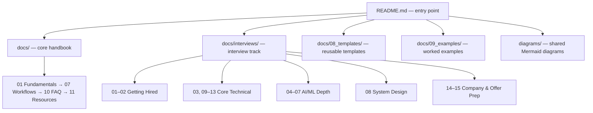
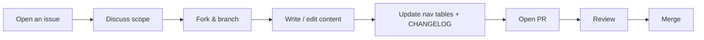

# AI Engineer Handbook 📚

[](LICENSE)
[](docs)
[](docs/interviews/README.md)
[](CHANGELOG.md)
[](CONTRIBUTING.md)

---

## 🎯 Vision

The **AI Engineer Handbook** is a single-source, production-ready knowledge base for anyone who wants to understand, build, operate, and get *hired* to work on AI-powered software. It's written for:

- **Beginners** who have never touched an LLM before.
- **Mid-level engineers** looking for best-practice patterns and production trade-offs.
- **Job seekers** preparing for AI engineering interviews — technical, ML/DL/LLM depth, system design, and the hiring process itself.
- **Senior architects** needing a fast reference for model selection, prompt engineering, and deployment.

After working through the handbook you'll be able to:
1. Explain what an AI assistant is and how it works internally.
2. Choose the right model for a given task and justify the trade-off.
3. Write high-quality prompts and avoid common failure modes.
4. Build end-to-end AI applications — chatbots, RAG systems, agents.
5. Deploy, monitor, and maintain AI services at production scale.
6. Walk into an AI engineering interview loop — technical, ML/LLM, system design, behavioral — prepared.

> 💡 **New here?** Start with [`docs/01_fundamentals.md`](docs/01_fundamentals.md) if you're learning the concepts, or jump straight to the [Interview Handbook](docs/interviews/README.md) if you're prepping for a role.

---

## ✨ Features

- **11 core handbook chapters** covering AI fundamentals through production workflows
- **15-document interview track** — Python/CS fundamentals, ML, DL, LLMs, AI agents, system design, DSA, SQL, APIs, cloud, DevOps, company-specific prep, and hiring/negotiation
- **Reusable templates** for READMEs, API docs, system design docs, bug reports, and feature requests
- **Mermaid diagrams** embedded directly in markdown — render natively on GitHub, no extra tooling
- **Fully cross-linked** — every document links to what to read next
- **Pure Markdown** — works as a GitHub Pages site, an internal wiki import, or just browsing the repo directly

---

## 🏗️ Architecture

This repository is documentation, not a running service — "architecture" here means how content is organized so it stays navigable as it grows.



See the full navigation flow in [`diagrams/handbook_overview.mmd`](diagrams/handbook_overview.mmd).

---

## 📂 Folder Structure

```
ai-engineer-handbook/
├─ README.md                     # This file
├─ ROADMAP.md                    # Repository content roadmap
├─ PROGRESS.md                   # Current completion status
├─ CHANGELOG.md                  # Version history
├─ CONTRIBUTING.md               # Contribution guide
├─ LICENSE                       # MIT
├─ docs/
│   ├─ 01_fundamentals.md
│   ├─ 02_assistant_guide.md
│   ├─ 03_capability_guide.md
│   ├─ 04_model_guide.md
│   ├─ 05_prompt_engineering.md
│   ├─ 06_engineering_roadmap.md
│   ├─ 07_workflows.md
│   ├─ 08_templates/             # README, API, system design, bug/feature templates
│   ├─ 09_examples/              # Worked examples (chatbot, RAG, coding assistant)
│   ├─ 10_faq.md
│   ├─ 11_resources.md
│   ├─ image-generation/         # AI image generation handbook
│   └─ interviews/               # 🎤 Interview Handbook — 15 documents
│       ├─ README.md
│       ├─ 01_resume_preparation.md
│       ├─ 02_hr_behavioral.md
│       ├─ 03_technical_python.md
│       ├─ 04_ml_interview.md
│       ├─ 05_dl_interview.md
│       ├─ 06_llm_interview.md
│       ├─ 07_ai_agents.md
│       ├─ 08_system_design.md
│       ├─ 09_coding_interview.md
│       ├─ 10_sql_guide.md
│       ├─ 11_api_guide.md
│       ├─ 12_cloud_guide.md
│       ├─ 13_devops_guide.md
│       ├─ 14_company_preparation.md
│       └─ 15_hiring_preparation.md
├─ diagrams/                     # Shared Mermaid diagrams
│   ├─ handbook_overview.mmd
│   └─ fundamentals.mmd
└─ .github/
    └─ ISSUE_TEMPLATE/
        ├─ bug_report.md
        └─ feature_request.md
```

> All documentation is pure Markdown with Mermaid diagrams where visualization helps. Ready to use as a GitHub Pages site (`/docs`) or import into an internal wiki.

---

## 🧰 Tech Stack

This is a documentation repository — the "stack" is intentionally minimal so it's easy to fork, read, and contribute to without any build step:

| Layer | Choice | Why |
|---|---|---|
| Content format | Markdown (`.md`) | Renders natively on GitHub/GitLab, zero build step, diffable in PRs |
| Diagrams | Mermaid (`.mmd`, inline fences) | Renders directly in GitHub markdown, no external image assets to keep in sync |
| Optional publishing | GitHub Pages / MkDocs / Docusaurus | The `docs/` layout is compatible with common static-site generators if you want a browsable site |
| CI (optional) | GitHub Actions | Suggested for link-checking and markdown linting — see [Development Workflow](#-development-workflow) |

---

## 🚀 Installation & Setup

No build step is required to read the handbook — browse it directly on GitHub. To work on it locally:

```bash
# Clone the repository
git clone https://github.com/yourusername/ai-engineer-handbook.git
cd ai-engineer-handbook

# (Optional) install a markdown linter for contribution checks
npm install -g markdownlint-cli

# (Optional) install a link checker
npm install -g markdown-link-check
```

### Environment Variables
None required — this repository has no runtime configuration. If you add tooling (a static-site generator, a search index, a CI link-checker), document any required environment variables here as they're introduced.

### Running Locally
```bash
# Lint all markdown files
markdownlint '**/*.md' --ignore node_modules

# Check for broken internal/external links
find . -name "*.md" -not -path "./node_modules/*" | xargs -I{} markdown-link-check {}

# Preview with any Markdown viewer, or serve with a static-site generator, e.g.:
pip install mkdocs
mkdocs serve   # if you've added an mkdocs.yml
```

### Production Deployment
If you choose to publish this as a site rather than a browsable repo:
1. **GitHub Pages**: enable Pages in repo settings, pointing at `/docs` or a `gh-pages` branch built via Actions.
2. **MkDocs/Docusaurus**: add the relevant config file at the repo root, point its docs root at `docs/`, and deploy the generated static site to your host of choice (Netlify, Vercel, GitHub Pages).
3. **Internal wiki**: most wiki tools (Confluence, Notion, GitBook) support bulk Markdown import — the relative links throughout this repo use standard Markdown link syntax and should translate cleanly.

---

## 🔄 Development Workflow



See [`CONTRIBUTING.md`](CONTRIBUTING.md) for the full guide, including style conventions and PR expectations.

---

## 📖 Quick Navigation

| Section | Path | Description |
|---|---|---|
| **1️⃣ AI Fundamentals** | [`docs/01_fundamentals.md`](docs/01_fundamentals.md) | Core concepts — AI, LLMs, Transformers, Tokens, Embeddings, Vector DBs, RAG, Fine-tuning, Agents, MCP, Function calling, Context windows, Memory |
| **2️⃣ AI Assistant Guide** | [`docs/02_assistant_guide.md`](docs/02_assistant_guide.md) | What an assistant is, how it works, strengths, limitations, hallucinations, memory, tool usage, best practices |
| **3️⃣ Capability Guide** | [`docs/03_capability_guide.md`](docs/03_capability_guide.md) | Practical examples for programming, web, mobile, DevOps, security, data science, robotics |
| **4️⃣ Model Guide** | [`docs/04_model_guide.md`](docs/04_model_guide.md) | Model families, trade-offs, cost vs performance, when to use which |
| **5️⃣ Prompt Engineering** | [`docs/05_prompt_engineering.md`](docs/05_prompt_engineering.md) | Prompt levels, chain-of-thought, structured prompts, JSON/XML, system/role prompts, few-shot, optimization |
| **6️⃣ Engineering Roadmap** | [`docs/06_engineering_roadmap.md`](docs/06_engineering_roadmap.md) | Step-by-step learning path from Python basics to production AI systems |
| **7️⃣ Workflows** | [`docs/07_workflows.md`](docs/07_workflows.md) | End-to-end pipelines for chatbots, agents, RAG, SaaS MVPs, hackathon projects |
| **8️⃣ Templates** | [`docs/08_templates/`](docs/08_templates/README.md) | Reusable markdown templates for READMEs, API docs, system designs, bug reports, feature requests |
| **9️⃣ Examples** | [`docs/09_examples/`](docs/09_examples/README.md) | Worked examples for chatbots, RAG, and coding assistants |
| **🔟 FAQ** | [`docs/10_faq.md`](docs/10_faq.md) | Practical Q&A |
| **📚 Resources** | [`docs/11_resources.md`](docs/11_resources.md) | Curated books, papers, courses, repos |
| **🖼️ Image Generation** | [`docs/image-generation/`](docs/image-generation/AI_Image_Generation_Handbook.md) | AI image generation concepts and workflows |
| **🎤 Interview Handbook** | [`docs/interviews/`](docs/interviews/README.md) | 15-document track: resume, behavioral, Python, ML, DL, LLM, agents, system design, DSA, SQL, APIs, cloud, DevOps, company prep, hiring |

### 🎤 Interview Handbook — Full Table
| # | Document | Covers |
|---|---|---|
| 1 | [Resume Preparation](docs/interviews/01_resume_preparation.md) | ATS mechanics, GitHub/LinkedIn/portfolio optimization |
| 2 | [HR & Behavioral](docs/interviews/02_hr_behavioral.md) | STAR method, common questions with model answers |
| 3 | [Technical / Python](docs/interviews/03_technical_python.md) | OOP, SOLID, decorators, concurrency, memory management |
| 4 | [ML Interview](docs/interviews/04_ml_interview.md) | Classical ML, ensembles, evaluation metrics |
| 5 | [DL Interview](docs/interviews/05_dl_interview.md) | CNN/RNN/LSTM, transformers, attention, optimization |
| 6 | [LLM Interview](docs/interviews/06_llm_interview.md) | RAG, fine-tuning/LoRA/QLoRA, inference, hallucination |
| 7 | [AI Agents](docs/interviews/07_ai_agents.md) | Agent architectures, tool calling, MCP, multi-agent frameworks |
| 8 | [System Design](docs/interviews/08_system_design.md) | Building blocks + worked designs (chat product, RAG, Uber, YouTube...) |
| 9 | [Coding Interview](docs/interviews/09_coding_interview.md) | DSA patterns with code, Blind-75-style practice set |
| 10 | [SQL Guide](docs/interviews/10_sql_guide.md) | Joins, indexes, transactions, window functions |
| 11 | [API Guide](docs/interviews/11_api_guide.md) | REST, GraphQL, auth, rate limiting, versioning |
| 12 | [Cloud Guide](docs/interviews/12_cloud_guide.md) | AWS/Azure/GCP, IAM, networking, containers |
| 13 | [DevOps Guide](docs/interviews/13_devops_guide.md) | Docker, Kubernetes, CI/CD, Terraform |
| 14 | [Company Preparation](docs/interviews/14_company_preparation.md) | Process patterns: frontier AI labs, big tech, startups |
| 15 | [Hiring Preparation](docs/interviews/15_hiring_preparation.md) | Portfolio, networking, salary negotiation, offer comparison |

---

## 📊 Current Progress

```
Core Handbook          ██████████████████████████████ 100%
Interview Track (15/15) ██████████████████████████████ 100%
Templates & Examples    ████████████████████████████░░  95%
```

See [`PROGRESS.md`](PROGRESS.md) for the full per-file breakdown and known gaps.

## 🗺️ Roadmap

- ✅ **v2.0 (July 2026)**: Full interview track (15 docs), repo documentation (ROADMAP/PROGRESS/CHANGELOG), README rewrite
- 🚧 **In progress**: Expanded worked examples under `docs/09_examples/`
- 📋 **Planned**: Company-specific question banks, downloadable PDF build, community mock-interview question bank

Full detail in [`ROADMAP.md`](ROADMAP.md).

---

## 🛠️ Contributing

Contributions are welcome — fixes, new examples, expanded guides, or entirely new sections. Read [`CONTRIBUTING.md`](CONTRIBUTING.md) for:
- How to propose and submit changes
- Style conventions for new documents
- Issue templates for [bug reports](.github/ISSUE_TEMPLATE/bug_report.md) and [feature requests](.github/ISSUE_TEMPLATE/feature_request.md)

---

## 📜 License

[MIT](LICENSE) © 2026 AI Engineer Handbook contributors.

## 📬 Contact

Open an [issue](.github/ISSUE_TEMPLATE) for questions, corrections, or suggestions — that's the fastest way to reach the maintainers and keeps the discussion visible for others with the same question.

---
*Last updated 30 July 2026 · See [`CHANGELOG.md`](CHANGELOG.md) for full version history.*
