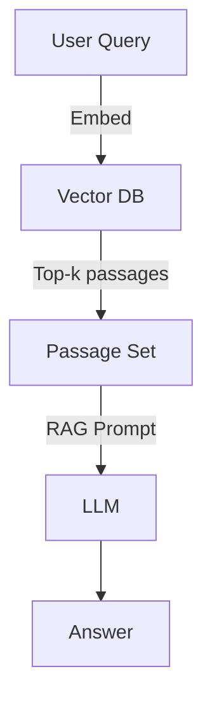

# 1️⃣ AI Fundamentals

## 1.1 What is AI?
Artificial Intelligence (AI) is the discipline that builds systems capable of performing tasks that normally require human intelligence: reasoning, perception, learning, planning, and natural‑language understanding.

## 1.2 Large Language Models (LLMs)
LLMs are neural networks trained on massive text corpora. They predict the next token given a context and can generate prose, code, or structured data.

## 1.3 Transformers – the core architecture
The transformer introduced **self‑attention**, allowing every token to attend to every other token in a single forward pass. This made it possible to scale models to billions of parameters.

```mermaid
flowchart LR
    A[Raw Text Input] --> B[Tokenizer]
    B --> C[Embedding Layer]
    C --> D[Transformer Encoder (self‑attention)]
    D --> E[Transformer Decoder (auto‑regressive)]
    E --> F[Detokenizer]
    F --> G[Generated Text Output]
```
*Figure 1 – End‑to‑end token flow in a transformer‑based LLM.*

## 1.4 Tokens & Tokenisation
- A **token** is the smallest unit the model processes – often a sub‑word piece.
- Tokenisers (BPE, WordPiece) map raw Unicode strings to integer IDs.
- Token count determines **cost** and **context‑window** usage.

## 1.5 Embeddings
Tokens are projected into high‑dimensional vectors (embeddings) that capture semantic meaning. These vectors are the model’s input to the attention layers.

## 1.6 Vector Databases
Vector DBs store embeddings and provide **approximate nearest‑neighbor (ANN)** search. Popular options:
- **Qdrant**, **Pinecone**, **Milvus** – all expose a simple REST/GRPC API.

## 1.7 Retrieval‑Augmented Generation (RAG)
RAG combines a **retriever** (vector DB) with a **generator** (LLM). The retriever fetches relevant passages, which are injected into the prompt.


*Figure 2 – Classic RAG pipeline.*

## 1.8 Fine‑tuning & LoRA
Fine‑tuning adapts a pre‑trained model to a domain. **LoRA** (Low‑Rank Adaptation) adds small trainable matrices, enabling cheap domain adaptation without updating the full weight matrix.

## 1.9 AI Agents & MCP
Agents are LLMs equipped with **tool use**. The **Model‑Calling‑Protocol (MCP)** defines a JSON schema for the model to request external functions (search, code execution, etc.).

## 1.10 Context Windows & Memory
- **Context window**: maximum tokens the model can attend to (e.g., 4 k, 8 k, 32 k).
- **Short‑term memory**: the conversation history stored inside the window.
- **Long‑term memory**: external vector stores, databases, or files accessed via tools.

---

*All diagrams are rendered by GitHub's Mermaid support.*