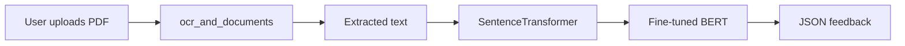

# 7️⃣ Workflows

This chapter provides **step‑by‑step, production‑grade pipelines** for common AI‑driven products.  Each workflow includes:
1. High‑level architecture diagram (Mermaid).
2. Required tools and libraries.
3. Minimal reproducible code snippets.
4. Deployment checklist.

---

## 7.1 Building an AI Chatbot (LLM + Retrieval)
### Architecture
```mermaid
flowchart LR
    A[User UI] --> B[API Gateway (FastAPI)]
    B --> C[Prompt Builder]
    C --> D[LLM (Chat Completion)]
    D --> E[Response Formatter]
    E --> A
    C --> F[Vector DB (Qdrant)]
    F --> D
```
### Steps
1. **Create a FastAPI project** (`app.py`).
2. **Ingest documents** → embeddings via `sentence‑transformers` → upsert into Qdran`t`.
3. **Endpoint `/chat`** receives user message, retrieves top‑k passages, builds a RAG prompt, calls the LLM, returns answer.
4. **Dockerise** the service and push to a container registry.
5. **Deploy** to Kubernetes with a `Deployment` and `Service`.
6. **Add observability** – OpenTelemetry middleware for request tracing.

### Minimal Code (Python)
```python
from fastapi import FastAPI, HTTPException
from qdrant_client import QdrantClient
from sentence_transformers import SentenceTransformer
import openai

app = FastAPI()
model = SentenceTransformer('all-MiniLM-L6-v2')
client = QdrantClient(url='http://qdrant:6333')

@app.post('/chat')
async def chat(message: str):
    # 1️⃣ embed query
    query_vec = model.encode(message).tolist()
    # 2️⃣ retrieve context
    hits = client.search(collection_name='docs', query_vector=query_vec, limit=5)
    context = "\n".join(hit.payload['text'] for hit in hits)
    # 3️⃣ build RAG prompt
    prompt = f"Context:\n{context}\n\nQuestion: {message}\nAnswer:" 
    # 4️⃣ call LLM (OpenAI example)
    resp = openai.ChatCompletion.create(model='gpt-4o-mini', messages=[{'role':'user','content':prompt}])
    return {'answer': resp.choices[0].message.content}
```
### Checklist
- ✅ **Rate limiting** on `/chat` (e.g., `slowapi`).
- ✅ **Input sanitisation** – strip malicious code blocks.
- ✅ **Logging** – store query, context IDs, latency.
- ✅ **Monitoring** – Prometheus metrics for request count & latency.
- ✅ **Rollback** – Helm chart with `revisionHistoryLimit`.

---

## 7.2 AI Agent for Autonomous Task Execution
### Architecture
```mermaid
flowchart TD
    A[User Goal] --> B[Agent Controller]
    B --> C{Tool Selector}
    C -->|Web Search| D[web_search]
    C -->|Code Exec| E[execute_code]
    C -->|File Ops| F[read/write_file]
    D & E & F --> B
    B --> G[LLM (reasoning)]
    G --> H[Plan & Execute]
    H --> A
```
### Steps
1. **Define a system prompt** that describes the agent’s role and allowed tools.
2. **Implement a tool wrapper** (`tool_registry.py`) exposing functions to the LLM via MCP.
3. **Loop**: send user goal → LLM → parse function call → execute tool → feed result back → repeat until `final_answer`.
4. **Persist state** in a tiny SQLite DB (`agent_state.db`).
5. **Deploy** as a FastAPI endpoint `/agent`.

### Minimal Code (Python)
```python
import json, subprocess
from fastapi import FastAPI
from hermes_tools import terminal  # hypothetical wrapper for tool calls

app = FastAPI()
SYSTEM = "You are an autonomous AI agent. You may call the following tools: web_search, execute_code, read_file, write_file. Return JSON with 'tool' and 'args'."

def call_llm(messages):
    # placeholder for actual LLM call (OpenAI, Anthropic, etc.)
    return openai.ChatCompletion.create(model='gpt-4o', messages=messages).choices[0].message.content

@app.post('/agent')
async def run(goal: str):
    history = [{'role':'system','content':SYSTEM}, {'role':'user','content':goal}]
    while True:
        response = call_llm(history)
        try:
            payload = json.loads(response)
        except json.JSONDecodeError:
            return {'error':'LLM did not return valid JSON'}
        tool = payload.get('tool')
        args = payload.get('args',{})
        if tool == 'final_answer':
            return {'answer':payload.get('output')}
        # Execute tool
        if tool == 'web_search':
            out = terminal(command=f"curl -s 'https://ddg-api.com/search?q={args['query']}'")['output']
        elif tool == 'execute_code':
            out = terminal(command=args['code'])['output']
        elif tool == 'read_file':
            out = open(args['path']).read()
        elif tool == 'write_file':
            open(args['path'],'w').write(args['content'])
            out = 'written'
        else:
            out = 'unknown tool'
        history.append({'role':'assistant','content':response})
        history.append({'role':'tool','content':out})
```
### Checklist
- ✅ **Safety guard** – whitelist only approved commands.
- ✅ **Timeouts** for `execute_code` (30 s).
- ✅ **Logging** of each tool call.
- ✅ **State persistence** for multi‑turn sessions.

---

## 7.3 Coding Assistant (IDE Integration)
### Architecture
```mermaid
flowchart LR
    IDE -->|WebSocket| API[FastAPI]
    API --> LLM[LLM (code model)]
    LLM -->|code suggestion| API
    API -->|apply patch| IDE
```
### Steps
1. **Create a WebSocket endpoint** (`/ws`) that streams suggestions.
2. **Prompt template** includes the file content, cursor position, and desired operation.
3. **LLM call** with `temperature=0` for deterministic output.
4. **Parse the response** as a diff (`git apply --cached`) and send back to the IDE.
5. **Add a fallback** to run `pylint`/`eslint` on the generated code.

### Minimal Code (Python)
```python
import json, subprocess
from fastapi import FastAPI, WebSocket
import openai
app = FastAPI()

@app.websocket('/ws')
async def ws(ws: WebSocket):
    await ws.accept()
    while True:
        data = await ws.receive_text()
        payload = json.loads(data)
        file = payload['file']
        cursor = payload['cursor']
        instruction = payload['instruction']
        prompt = f"File content:\n{file}\n\nCursor at line {cursor}.\nInstruction: {instruction}\n\nProvide a unified diff."
        resp = openai.ChatCompletion.create(model='gpt-4o-mini', messages=[{'role':'user','content':prompt}])
        diff = resp.choices[0].message.content
        await ws.send_text(json.dumps({'diff': diff}))
```
### Checklist
- ✅ **Security** – sandbox diff application (`git apply --check`).
- ✅ **Performance** – keep WebSocket connections alive, reuse LLM client.
- ✅ **Testing** – unit test diff generation with known inputs.

---

## 7.4 Resume Analyzer (NLP + Classification)
### Architecture

### Steps
1. **Upload endpoint** (`/resume`) accepts PDF.
2. **OCR** using `pytesseract` (or Azure OCR API).
3. **Embed** the extracted text.
4. **Classify** sections (experience, education, skills) with a small fine‑tuned model.
5. **Return** a structured JSON with strength scores and suggestions.

### Minimal Code (Python)
```python
from fastapi import FastAPI, File, UploadFile
import pytesseract, pdf2image
from sentence_transformers import SentenceTransformer
from transformers import AutoModelForSequenceClassification, AutoTokenizer

app = FastAPI()
embed = SentenceTransformer('all-MiniLM-L6-v2')
clf = AutoModelForSequenceClassification.from_pretrained('nlptown/bert-base-multilingual-uncased-sentiment')
tokenizer = AutoTokenizer.from_pretrained('nlptown/bert-base-multilingual-uncased-sentiment')

@app.post('/resume')
async def analyse(file: UploadFile = File(...)):
    images = pdf2image.convert_from_bytes(await file.read())
    text = "\n".join(pytesseract.image_to_string(img) for img in images)
    vec = embed.encode(text)
    inputs = tokenizer(text, return_tensors='pt')
    scores = clf(**inputs).logits.softmax(dim=-1).tolist()
    return {'summary': text[:500], 'sentiment': scores}
```
### Checklist
- ✅ **PDF size limit** (5 MB). 
- ✅ **Rate limit** – max 2 resumes/minute.
- ✅ **Privacy** – delete temporary files after processing.

---

## 7.5 RAG System for Knowledge Base (Enterprise)
### Architecture
```mermaid
flowchart TD
    A[User Query] --> B[Prompt Builder]
    B --> C[Vector DB (Pinecone)]
    C --> D[Top‑k Retrieval]
    D --> E[LLM (RAG Prompt)]
    E --> F[Answer]
    F --> G[Post‑processing (cite, filter)]
    G --> A
```
### Steps
1. **Document ingestion pipeline** (cron job) that extracts text, creates embeddings, upserts to Pinecone.
2. **API endpoint** `/search` that:
   - Embeds the query.
   - Retrieves top‑k passages.
   - Constructs a RAG prompt with citations.
   - Calls LLM with `temperature=0`.
   - Returns answer + source IDs.
3. **Feedback loop** – store user‑rated answers to fine‑tune the retriever.

### Minimal Code (Python)
```python
from fastapi import FastAPI, Query
from pinecone import PineconeClient
from sentence_transformers import SentenceTransformer
import openai

app = FastAPI()
pc = PineconeClient(api_key='PINECONE_KEY')
index = pc.Index('knowledge-base')
embed = SentenceTransformer('all-MiniLM-L6-v2')

@app.get('/search')
async def search(q: str = Query(...), k: int = 5):
    q_vec = embed.encode(q).tolist()
    hits = index.query(vector=q_vec, top_k=k, include_metadata=True)
    context = "\n".join(hit['metadata']['text'] for hit in hits['matches'])
    prompt = f"Answer the question using only the following context. Cite sources with IDs.\n\nContext:\n{context}\n\nQuestion: {q}\nAnswer:" 
    resp = openai.ChatCompletion.create(model='gpt-4o-mini', messages=[{'role':'user','content':prompt}])
    answer = resp.choices[0].message.content
    return {'answer': answer, 'sources': [hit['id'] for hit in hits['matches']]}
```
### Checklist
- ✅ **Index versioning** – re‑index when documents change.
- ✅ **Latency SLA** – aim < 500 ms for retrieval + LLM call.
- ✅ **Security** – API key rotation, role‑based access.

---

## 7.6 SaaS MVP (Full Stack)
### Stack
- **Frontend**: React + Vite + TailwindCSS
- **Backend**: FastAPI (Python) exposing `/chat` and `/auth`
- **Auth**: JWT + Refresh tokens (OAuth2PasswordBearer)
- **Database**: PostgreSQL (SQLModel ORM)
- **AI**: OpenAI `gpt-4o-mini` for chat, `text-embedding-ada-002` for RAG
- **Infra**: Docker Compose for local dev, Helm chart for k8s prod

### Steps (high level)
1. Scaffold React app (`npm create vite@latest`), add Tailwind.
2. Scaffold FastAPI project (`fastapi‑start`), add JWT auth.
3. Implement `/chat` using the **RAG workflow** from 7.1.
4. Store conversation history in PostgreSQL.
5. Containerise both services, add `docker‑compose.yml`.
6. Write Helm chart (`charts/ai‑mvp`) with ConfigMaps for secrets.
7. Set up CI (GitHub Actions) to lint, test, build images, and push to Docker Hub.
8. Deploy to a managed k8s cluster (EKS, GKE, or AKS).
9. Add **Prometheus** metrics (`fastapi‑prometheus`) and **Grafana** dashboard.
10. Enable **feature flags** (LaunchDarkly or open‑source `unleash`) for beta features.

### Minimal `docker-compose.yml`
```yaml
version: '3.9'
services:
  api:
    build: ./backend
    ports:
      - '8000:8000'
    environment:
      - OPENAI_API_KEY=${OPENAI_API_KEY}
      - DATABASE_URL=postgresql://postgres:pwd@db/postgres
  web:
    build: ./frontend
    ports:
      - '5173:5173'
  db:
    image: postgres:15-alpine
    environment:
      POSTGRES_PASSWORD: pwd
    volumes:
      - pgdata:/var/lib/postgresql/data
volumes:
  pgdata:
```
### Checklist
- ✅ **Health checks** for API and DB.
- ✅ **Zero‑downtime deploy** – Helm `strategy: RollingUpdate`.
- ✅ **Rate limiting** – `slowapi` on `/chat`.
- ✅ **Audit logging** – store each request/response in DB.

---

## 7.7 Hackathon Project (48‑hour Sprint)
1. **Idea**: AI‑powered “Idea Generator” that takes a short description and returns a full product spec, mock UI, and a starter repo.
2. **Tech**: Next.js (frontend), LangChain agent (backend), OpenAI `gpt‑4o`, GitHub API for repo creation.
3. **Workflow**:
   - User fills a form → `/generate` endpoint.
   - Agent builds a **plan** (outline, UI wireframes, tech stack).
   - Calls `github` tool to create repo, push generated files.
   - Returns repo URL.
4. **Demo**: Live preview of generated UI using Vercel preview URLs.

---

## 7.8 Startup MVP (AI‑First Product)
| Phase | Goal | Key Deliverable |
|-------|------|-----------------|
| **Validate** | Market research via LLM‑driven surveys | Survey script + analysis notebook |
| **Prototype** | Minimal UI + RAG backend | Deployable Docker image |
| **Growth** | Add analytics, A/B testing, payment integration | Stripe integration, feature flags |
| **Scale** | Autoscaling, multi‑region, compliance | Kubernetes with HPA, GDPR audit logs |

---

*All workflows are intentionally technology‑agnostic; replace the concrete tools with equivalents you prefer (e.g., Azure Cognitive Search instead of Pinecone, or Cohere instead of OpenAI).*
