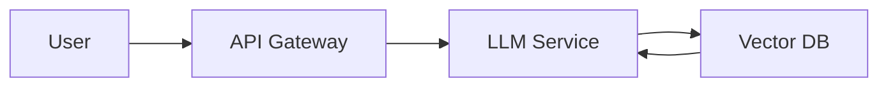
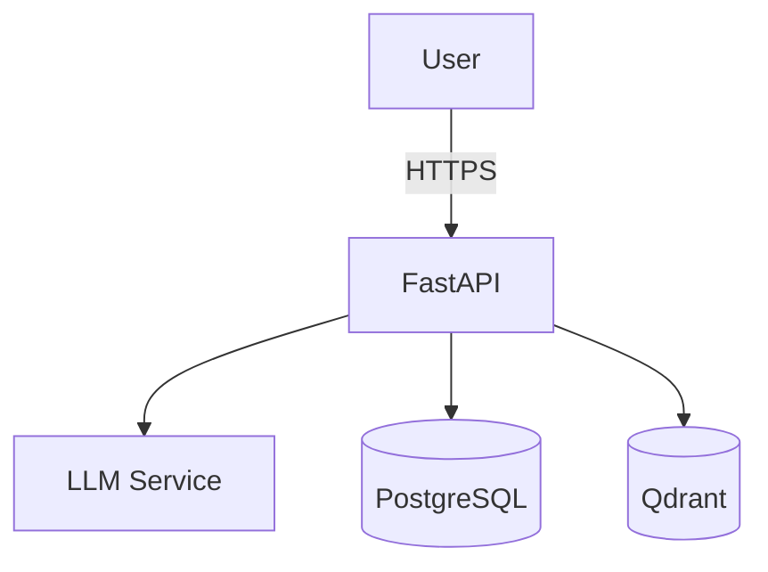

# 8️⃣ Templates

This folder contains **reusable markdown templates** that can be copied into any AI project.  All templates are deliberately minimal; you can extend them with your own branding or CI badges.

## 8.1 Project README Template (`project_readme_template.md`)
```markdown
# Project Title

[](LICENSE)
[](https://github.com/<owner>/<repo>/actions)

## Overview
A short paragraph describing the purpose of the project, the problem it solves, and the target audience.

## Architecture


## Getting Started
```bash
# Clone the repo
git clone https://github.com/<owner>/<repo>.git
cd <repo>
# Install dependencies
pip install -r requirements.txt
# Run locally
uvicorn app:app --reload
```

## Usage
Explain the main commands or API endpoints with example curl requests.

## Contributing
See [CONTRIBUTING.md](CONTRIBUTING.md) for guidelines.

## License
MIT © <Year> <Your Name>
```

## 8.2 API Documentation Template (`api_doc_template.md`)
```markdown
# API Reference

All endpoints are served under `/api/v1/` and require a JWT token.

## Authentication
```http
POST /auth/login
Content-Type: application/json

{ "username": "...", "password": "..." }
```
Response:
```json
{ "access_token": "...", "refresh_token": "..." }
```

## Endpoints
### `POST /chat`
**Description**: Sends a user message to the LLM and returns a response.
**Request**:
```json
{ "message": "Your question here" }
```
**Response**:
```json
{ "answer": "...", "sources": ["doc1", "doc2"] }
```

*Add more endpoints as needed.*
```

## 8.3 System Design Template (`system_design_template.md`)
```markdown
# System Design Document

## 1. Goals & Non‑functional Requirements
- **Scalability**: handle 10 k RPS.
- **Latency**: < 200 ms for inference.
- **Security**: JWT auth, rate limiting, audit logs.

## 2. High‑level Architecture


## 3. Data Flow
1. Request hits API gateway.
2. Service validates JWT.
3. Retrieves context from VectorDB.
4. Calls LLM with RAG prompt.
5. Persists conversation to DB.
6. Returns response.

## 4. Deployment Diagram
- **Kubernetes** cluster with separate namespaces for `dev`, `staging`, `prod`.
- **Ingress** (NGINX) with TLS termination.
- **Horizontal Pod Autoscaler** based on CPU & request latency.

## 5. Failure Modes & Mitigations
| Failure | Impact | Mitigation |
|---------|--------|------------|
| LLM timeout | No answer | Fallback static response |
| Vector DB outage | Degraded relevance | Cache recent passages |
| Token leakage | Security breach | Rotate secrets daily |
```

## 8.4 Prompt Template (`prompt_template.md`)
```markdown
**System Prompt**
You are a helpful AI assistant specialized in **<domain>**. Follow these rules:
1. Always cite sources when providing factual information.
2. Use **JSON** output with the schema:
```json
{ "answer": "...", "citations": ["doc_id"] }
```
3. If you are unsure, say *I don't know*.

**User Prompt Example**
"Summarise the key takeaways from the attached PDF and list actionable items."
```

## 8.5 Bug Report Template (`bug_report_template.md`)
```markdown
---
name: Bug Report
about: Report a problem with the handbook or code examples
---

**Describe the bug**
A clear and concise description of what the bug is.

**Steps to reproduce**
1. Go to '...'
2. Click on '....'
3. See error

**Expected behavior**
What you expected to happen.

**Screenshots / Logs**
If applicable, add screenshots or log excerpts.

**Environment**
- OS: ...
- Python version: ...
- Model used: ...

**Additional context**
Add any other context about the problem here.
```

## 8.6 Feature Request Template (`feature_request_template.md`)
```markdown
---
name: Feature Request
about: Suggest a new feature or improvement for the handbook
---

**Is your request related to a problem?**
A short description of the problem you are trying to solve.

**Proposed solution**
Describe the solution you'd like.

**Alternatives considered**
Any alternative approaches you have thought about.

**Additional context**
Add any other context or screenshots about the feature request here.
```
