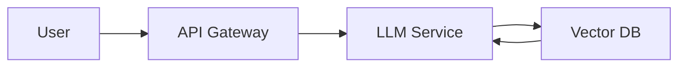

# Project README Template

[](LICENSE)
[](https://github.com/<owner>/<repo>/actions)

## Overview
A concise description of what the project does, the problem it solves, and its target audience.

## Architecture


## Getting Started
```bash
# Clone the repository
git clone https://github.com/<owner>/<repo>.git
cd <repo>
# Install dependencies
pip install -r requirements.txt
# Run locally
uvicorn app:app --reload
```

## Usage
Provide example commands or API calls with expected output.

## Contributing
Please read [CONTRIBUTING.md](CONTRIBUTING.md) for guidelines.

## License
MIT © <Year> <Your Name>
