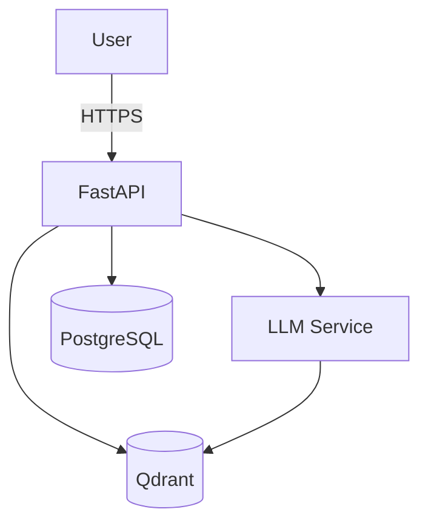

# 8.3 System Design Template (`system_design_template.md`)

```markdown
# System Design Document

## 1. Goals & Non‑functional Requirements
- **Scalability**: support up to 10 k requests per second.
- **Latency**: < 200 ms for inference‑plus‑retrieval.
- **Reliability**: 99.9 % uptime (SLA).
- **Security**: JWT authentication, rate limiting, audit logging.
- **Observability**: metrics, traces, logs.

## 2. High‑level Architecture


## 3. Data Flow
1. Request reaches API gateway, JWT is validated.
2. API queries VectorDB for relevant context.
3. Context + user query are combined into a RAG prompt.
4. Prompt is sent to the LLM.
5. LLM response is post‑processed and returned to the user.
6. Conversation is persisted in PostgreSQL.

## 4. Deployment Diagram
- **Kubernetes** cluster with separate namespaces (`dev`, `staging`, `prod`).
- **Ingress** (NGINX) with TLS termination.
- **Horizontal Pod Autoscaler** based on CPU & request latency.
- **ConfigMaps** for model endpoints and secrets (mounted via `secrets-store` CSI driver).

## 5. Failure Modes & Mitigations
| Failure | Impact | Mitigation |
|---------|--------|------------|
| LLM timeout | No answer | Fallback static response or cached answer |
| VectorDB outage | Reduced relevance | Cache recent passages locally |
| Token leakage | Security breach | Rotate secrets daily, enable audit logs |
| High load spikes | Latency increase | Autoscale pods, queue requests with RabbitMQ |

## 6. Security Considerations
- **Input sanitisation** for any code execution tools.
- **Rate limiting** (`slowapi`) per user/IP.
- **Least‑privilege IAM** for cloud resources.
- **Data encryption** at rest (PostgreSQL `pgcrypto`) and in transit (TLS).

## 7. Observability
- **Metrics**: Prometheus exporter (`fastapi‑prometheus`).
- **Tracing**: OpenTelemetry SDK for FastAPI, exported to Jaeger.
- **Logging**: Structured JSON logs to Loki.

---

*Adapt this template to your specific stack (e.g., replace FastAPI with NestJS or Go Gin).*
