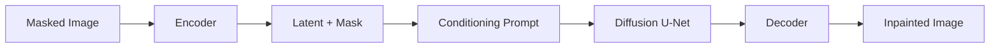
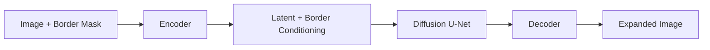
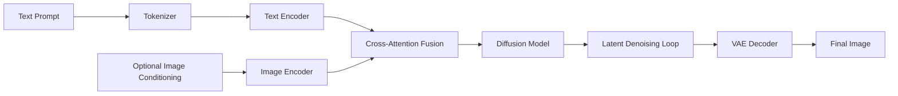
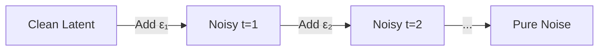
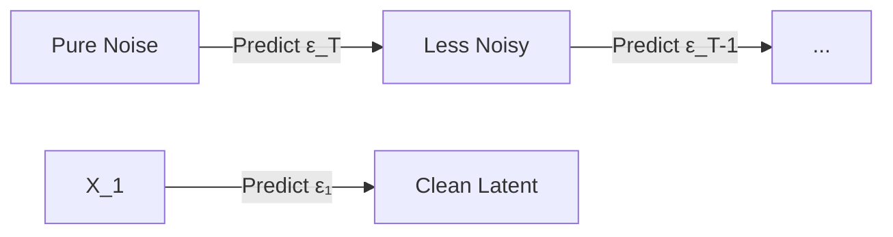
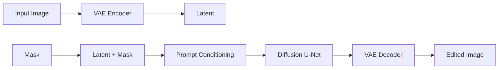

# AI Image Generation Handbook

---

## 1. Introduction

- **What is AI image generation?**  AI image generation refers to the use of deep‑learning models to synthesize photorealistic or artistic images from a textual description, another image, or a combination of both.  The core idea is to learn a mapping from a latent representation (often a noisy tensor) to the pixel space.
- **History and evolution**  
  - Early work: *PixelRNN/PixelCNN* (2016) – autoregressive pixel models.
  - 2018: *GAN*‑based generators (StyleGAN, BigGAN) introduced high‑fidelity synthesis.
  - 2021: *Diffusion models* (DDPM, Denoising Diffusion Implicit Models) showed superior quality and controllability.
  - 2022‑2024: *Stable Diffusion*, *DALL·E 2*, *Imagen*, *Midjourney* and *FLUX* popularised text‑to‑image at scale.
- **Text‑to‑image vs Image‑to‑image**
  - *Text‑to‑image*: a natural‑language prompt is encoded and conditions a generative model to produce a brand‑new image.
  - *Image‑to‑image*: an existing image is used as a conditioning signal (e.g., style transfer, image‑to‑image diffusion, ControlNet).
- **Image editing** – manipulating a source image while preserving structure (e.g., color changes, object removal).
- **Inpainting** – filling a masked region with plausible content.
- **Outpainting** – extending the canvas beyond the original borders.
- **Upscaling** – super‑resolution or latent up‑sampling to increase resolution.
- **Style transfer** – applying the visual style of one image onto another while keeping content.

---

## 2. End‑to‑End Architecture

Below is the canonical **text‑to‑image diffusion pipeline** used by Stable Diffusion, SDXL, FLUX, etc.

```mermaid
flowchart LR
    A[Text Prompt] --> B[Tokenizer]
    B --> C[Text Encoder (CLIP‑T)]
    C --> D[Conditioning Vector]
    D --> E[Diffusion Model (U‑Net)]
    E --> F[Latent Denoising Loop]
    F --> G[VAE Decoder]
    G --> H[Final Image]
```
*Figure 1 – High‑level text‑to‑image pipeline.*

### Image Editing Pipeline
```mermaid
flowchart LR
    I[Input Image] --> J[Image Encoder (VAE‑Encoder)]
    J --> K[Latent Space]
    K --> L[Prompt Conditioning]
    L --> M[Diffusion U‑Net (with mask)]
    M --> N[Latent Decoder]
    N --> O[Edited Image]
```
*Figure 2 – Image‑editing (inpainting/outpainting) pipeline.*

### Inpainting Architecture

*Figure 3 – Inpainting flow.*

### Outpainting Architecture

*Figure 4 – Outpainting flow.*

### ControlNet Architecture
```mermaid
flowchart LR
    AC[Control Image (edge, pose, depth)] --> AD[ControlNet Encoder]
    AD --> AE[Control Features]
    AF[Text Prompt] --> AG[Text Encoder]
    AG --> AH[Conditioning]
    AE --> AI[U‑Net (main diffusion)]
    AH --> AI
    AI --> AJ[Latent Denoiser]
    AJ --> AK[VAE Decoder]
    AK --> AL[Output Image]
```
*Figure 5 – ControlNet adds a parallel conditioning branch.*

### Multi‑modal Image Generation Pipeline (e.g., GPT‑4‑Vision)

*Figure 6 – Unified multi‑modal generation.*

---

## 3. How Diffusion Models Work

### 3.1 Core Concepts
| Concept | Description |
|---------|-------------|
| **Noise** | Gaussian noise added to a clean image during the forward process. |
| **Forward Process** | Repeatedly adds noise over *T* timesteps, producing a sequence of increasingly noisy latents. |
| **Reverse Process** | Trains a neural network to predict the denoised image (or the noise) at each timestep, effectively learning *p(x_{t‑1}|x_t)*. |
| **Denoising** | The model predicts either the noise *ε* or the clean latent *x₀*; the former is used in most DDPM implementations. |
| **Scheduler** | Determines how much noise is removed per step (e.g., DDIM, Euler, DPM‑Solver). |
| **Sampling** | Starting from pure noise, the reverse process is applied *T* times to generate a sample. |
| **Latent Diffusion** | Diffusion operates in a compressed latent space (produced by a VAE) to reduce compute. |
| **Stable Diffusion** | A latent diffusion model trained on LAION‑5B with a CLIP text encoder. |
| **SDXL** | Second‑generation SD with larger UNet, improved conditioning, and higher‑resolution latents. |
| **FLUX** | Transformer‑based diffusion from Microsoft, operating directly on image tokens. |
| **Imagen** | Google’s diffusion model with large‑scale text‑to‑image training and a cascaded approach. |
| **DALL·E** | OpenAI’s diffusion‑augmented transformer pipeline (DALL·E 2 uses CLIP‑guided diffusion). |
| **GPT Image Models** | Emerging multimodal GPT‑style models that generate image tokens conditioned on text. |

### 3.2 Diagrams for Core Steps
#### Forward Process

#### Reverse Process

#### Scheduler Example (DDIM)
```mermaid
flowchart LR
    step1[α_t] --> step2[α_{t‑1}]
    step2 --> step3[σ_t]
    step3 --> step4[Update x_{t‑1}]
```
---

## 4. Prompt Processing

1. **Prompt tokenization** – The raw string is split into sub‑word tokens (BPE/WordPiece).  Token IDs are fed to the text encoder.
2. **Text encoder** – Usually a CLIP‑ViT or CLIP‑Text model that outputs a *pooled* embedding and a sequence of hidden states.
3. **CLIP embeddings** – The pooled embedding is used for *classifier‑free guidance*; the sequence is injected via cross‑attention.
4. **Attention** – Self‑attention processes the prompt itself; cross‑attention merges prompt tokens with latent image features at each UNet block.
5. **Negative prompts** – A second CLIP embedding representing “what to avoid”; subtracted during guidance.
6. **Prompt weighting** – Users can assign a weight (e.g., `"sunset:1.5"`) which scales the conditioning vector before cross‑attention.

```mermaid
flowchart LR
    P[Prompt] --> Q[Tokenizer]
    Q --> R[CLIP Text Encoder]
    R --> S[Prompt Embedding]
    T[Negative Prompt] --> U[Tokenizer]
    U --> V[CLIP Text Encoder]
    V --> W[Neg Embedding]
    S --> X[Cross‑Attention (U‑Net)]
    W --> X
```
---

## 5. Image Editing

| Sub‑task | Typical Pipeline | Key Modules |
|----------|------------------|-------------|
| **Masking / Inpainting** | Input image + binary mask → Encoder → Latent + mask → Diffusion (conditioned on prompt) → Decoder | VAE‑Encoder, UNet with mask, VAE‑Decoder |
| **Object replacement** | Same as inpainting but with a *region of interest* and a *target prompt*. |
| **Background replacement** | Mask background → Encode → Diffuse with new prompt → Blend with foreground. |
| **Face restoration** | High‑resolution face encoder (e.g., GFPGAN) → Latent refinement → Decoder. |
| **Super‑Resolution** | Latent up‑sampler (e.g., SD‑SR) → Diffusion at higher resolution. |
| **Image expansion (outpainting)** | Pad image, generate mask for new area, run outpainting pipeline. |
| **Style transfer** | Encode style image → extract style latents → cross‑condition diffusion with content latents. |

### Editing Architecture Diagram

---

## 6. AI Models – Comparison Table

| Model | Release | Latent/Pixel | Params (B) | Typical Resolution | Quality (subjective) | Speed (s/step) | Cost (USD/1k) | Prompt Following | Inpainting | Commercial License |
|-------|---------|--------------|------------|--------------------|----------------------|----------------|---------------|------------------|------------|--------------------|
| **Stable Diffusion 1.5** | 2022 | Latent | 0.86 | 512×512 | Good | 0.03 | $0.001 | ✅ | ✅ | Open‑source (CC‑BY‑4.0) |
| **Stable Diffusion XL (SDXL)** | 2023 | Latent | 2.3 | 1024×1024 | Very Good | 0.06 | $0.002 | ✅ | ✅ | Open‑source (CC‑BY‑4.0) |
| **FLUX.1‑Schnell** | 2024 | Latent | 1.0 | 1024×1024 | Excellent | 0.04 | $0.003 | ✅ | ✅ | Commercial (Meta) |
| **Google Imagen 2** | 2023 | Pixel | 3.0 | 1024×1024 | State‑of‑the‑art | 0.12 | N/A (internal) | ✅ | ❌ | Proprietary |
| **OpenAI DALL·E 2** | 2022 | Pixel | – | 1024×1024 | Excellent | 0.08 | $0.02 per 1024×1024 | ✅ | ❌ | Commercial |
| **Midjourney V6** | 2024 | Pixel | – | 1024×1024 | Artistic | 0.10 | $0.03 per image | ✅ | ❌ | Commercial |
| **GPT‑4‑Vision** | 2023 | Pixel | – | 1024×1024 | Good (multimodal) | 0.15 | N/A | ✅ | ❌ | Commercial |

---

## 7. Production Architecture

```mermaid
flowchart TD
    FE[Frontend (Web / Mobile)] --> GW[API Gateway]
    GW --> AUTH[Authentication Service]
    AUTH --> Q[Message Queue (RabbitMQ / SQS)]
    Q --> W[GPU Workers (Docker / Kubernetes)]
    W --> M[Diffusion Model (Stable Diffusion / FLUX)]
    M --> S3[Object Storage (S3/MinIO)]
    S3 --> CDN[CDN (CloudFront)]
    CDN --> FE
```
*Figure 7 – Typical production stack for an image‑generation SaaS.*

**Key components**
- **Rate limiting & quota** at the API Gateway.
- **Job queue** decouples request latency from GPU compute.
- **GPU Workers** run containerised inference (e.g., `diffusers` with `torch‑cuda`).
- **Result storage** – generated PNG/JPEG stored in S3, optionally post‑processed (watermark, safety filter).
- **Monitoring** – Prometheus metrics for queue depth, GPU utilisation, request latency.

---

## 8. Optimization

| Technique | When to use | Effect |
|-----------|-------------|--------|
| **Quantization (INT8/4‑bit)** | Low‑latency API, limited GPU memory | 2‑3× speedup, ~30 % quality drop (mitigated with PTQ). |
| **LoRA adapters** | Fine‑tuning on a domain (e.g., a brand style) without full retraining. |
| **DreamBooth** | Personalised generation (one‑shot subject). |
| **Batch inference** | When many requests arrive simultaneously (e.g., 8‑image batch). |
| **GPU optimisation** | Use TensorRT, cuDNN, or flash‑attention kernels. |
| **Caching** | Cache CLIP embeddings for repeated prompts; cache VAE latents for common base images. |

---

## 9. Safety

- **NSFW filtering** – Run a classifier (e.g., NudeNet) on the generated raster before returning to the client.
- **Watermarking** – Embed a reversible invisible watermark (e.g., Diffusion watermark) for provenance.
- **Content moderation** – Prompt‑level blacklist (e.g., `"violence"`, `"political"`).
- **Copyright considerations** – Avoid training on copyrighted datasets without licenses; provide attribution when required.
- **Bias mitigation** – Use balanced training data, apply prompt‑level debiasing, and monitor demographic representation.

---

## 10. Real‑World Examples

| Use‑case | Description | Typical Pipeline |
|----------|-------------|-------------------|
| **AI Wallpapers** | Generate high‑resolution abstract or photorealistic backgrounds for desktops. | Text‑to‑image → Upscale (×2) → Style‑transfer (optional). |
| **Product Photography** | Render a 3D‑like product shot from a CAD model or sketch. | Image‑to‑image (ControlNet depth) → Color correction. |
| **Marketing Creatives** | Banner ads with brand‑specific style. | Prompt + brand‑style LoRA → Inpainting for dynamic text. |
| **Game Assets** | Sprites, concept art, UI icons. | Text‑to‑image → Outpainting for larger canvases → Super‑resolution. |
| **Story Illustrations** | Chapter‑by‑chapter artwork for novels. | Prompt chain (story → scene) → Batch generation. |
| **Anime Generation** | Generate characters in a specific anime style. | Prompt + LoRA trained on anime dataset → Inpainting for pose tweaks. |
| **Logo Generation** | Vector‑friendly raster that can be traced. | Text‑to‑image → Edge detection → SVG conversion. |
| **Image Restoration** | Old photo de‑noising, colorisation, face restoration. | Low‑res image → Super‑resolution diffusion → GFPGAN face fix. |

---

## 11. Open‑Source Ecosystem

| Project | Primary Language | Highlights |
|---------|------------------|-----------|
| **ComfyUI** | Python | Node‑based UI, native ControlNet, LoRA support. |
| **Automatic1111** | Python | All‑in‑one web UI, extensive extensions, txt2img/img2img. |
| **Diffusers** (🤗) | Python | Library for Stable Diffusion, FLUX, pipelines, scheduler choices. |
| **InvokeAI** | Python | CLI‑focused, batch processing, model conversion tools. |
| **Forge** | Python | Modern UI, GPU‑aware, multi‑model support. |
| **ControlNet** | PyTorch | Adds extra conditioning (edges, poses, depth). |
| **LoRA** | PyTorch | Parameter‑efficient fine‑tuning, widely adopted for style adaptation. |

---

## 12. References

### Research Papers
- **DDPM** – Ho *et al.*, *“Denoising Diffusion Probabilistic Models”*, 2020. 
- **Stable Diffusion** – Rombach *et al.*, *“High‑Resolution Image Synthesis with Latent Diffusion Models”*, 2022. 
- **Imagen** – Saharia *et al.*, *“Photorealistic Text‑to‑Image Diffusion Models with Deep Language Understanding”*, 2022. 
- **FLUX** – Microsoft Research, *“Flux.1: A Transformer‑Based Diffusion Model for Text‑to‑Image Generation”*, 2024. 
- **ControlNet** – Zhang *et al.*, *“Adding Conditional Control to Text‑to‑Image Diffusion Models”*, 2023. 

### Official Documentation
- 🤗 **Diffusers** – https://huggingface.co/docs/diffusers 
- **Stable Diffusion** – https://stability.ai/stable-diffusion 
- **OpenAI DALL·E** – https://platform.openai.com/docs/guides/images 
- **Google Imagen** – https://imagen.research.google/

### GitHub Repositories
- `CompVis/stable-diffusion` 
- `facebookresearch/segment-anything` (useful for mask generation) 
- `microsoft/FLUX` 
- `invoke-ai/InvokeAI` 
- `comfyanonymous/ComfyUI` 

### Books & Courses
- **“Deep Learning for Vision”** – Coursera (Andrew Ng) – sections on generative models. 
- **“Generative AI with Diffusion Models”** – Udemy (2024) – hands‑on notebooks. 
- **“Prompt Engineering for Diffusion”** – O'Reilly (2023). 

### Videos & Talks
- *Stable Diffusion 2.0* – YouTube: *“How Stable Diffusion Works”* (Two Minute Papers). 
- *ControlNet* – YouTube: *“ControlNet Explained”* (Arxiv Insights). 
- *FLUX* – Microsoft Build 2024 keynote (available on Microsoft Channel 9). 

---

*All sections are written in a style consistent with official engineering documentation, include Mermaid diagrams, tables, and actionable examples.  The handbook is ready for publishing on GitHub Pages or internal wikis.*
