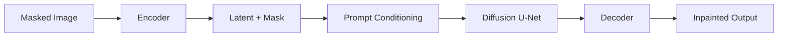
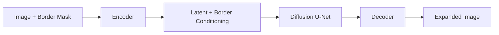
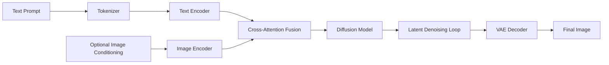
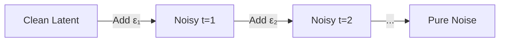
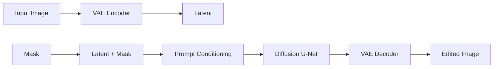

# AI Image Generation Handbook

---

## 1. Introduction

### What is AI image generation?
AI image generation is the process of creating visual content (photos, illustrations, textures, etc.) from a computational model that has learned the statistical distribution of images. Modern systems typically rely on **diffusion models** or **generative adversarial networks (GANs)** to synthesize high‑fidelity images conditioned on **text prompts**, **reference images**, or **both**.

### History and evolution
| Year | Milestone | Core Idea |
|------|-----------|-----------|
| 2015 | **PixelRNN / PixelCNN** | Autoregressive pixel‑wise generation. |
| 2016‑2018 | **GANs (DCGAN, StyleGAN, BigGAN)** | Adversarial training for photorealism. |
| 2020 | **DDPM** (Ho et al.) | Denoising diffusion probabilistic models – a new paradigm for generative modeling. |
| 2021 | **Stable Diffusion (v1)** | Latent‑space diffusion + CLIP conditioning – scalable, open‑source. |
| 2022 | **DALL·E 2** | Diffusion + CLIP guidance for text‑to‑image. |
| 2022‑2023 | **Imagen, Midjourney, SDXL** | Larger datasets, cascaded diffusion, higher resolution. |
| 2024 | **FLUX** | Transformer‑based diffusion, higher efficiency. |

### Text‑to‑image vs Image‑to‑image
- **Text‑to‑image** – a natural‑language description is encoded and used to condition a diffusion model that generates a brand‑new image.
- **Image‑to‑image** – an existing image (or its features) is fed into the model as a conditioning signal. Typical use‑cases: style transfer, image editing, ControlNet conditioning (edges, depth, pose).

### Image editing, Inpainting, Outpainting, Upscaling, Style transfer
| Task | Definition |
|------|------------|
| **Image editing** | Modify a source image while preserving its structure (e.g., recolor, replace objects). |
| **Inpainting** | Fill a masked region with plausible content based on surrounding pixels and optional prompts. |
| **Outpainting** | Extend the canvas beyond the original borders, generating new content that blends with the existing image. |
| **Upscaling / Super‑Resolution** | Increase resolution (e.g., 512 → 2048) while adding realistic details. |
| **Style transfer** | Apply the visual style of one image onto the content of another. |

---

## 2. End‑to‑End Architecture

### 2.1 Text‑to‑Image Diffusion Pipeline
```mermaid
flowchart LR
    A[Text Prompt] --> B[Tokenizer]
    B --> C[Text Encoder (CLIP‑T)]
    C --> D[Conditioning Vector]
    D --> E[Diffusion Model (U‑Net)]
    E --> F[Latent Denoising Loop]
    F --> G[VAE Decoder]
    G --> H[Final Image]
```
*Figure 1 – High‑level text‑to‑image pipeline.*

### 2.2 Image Editing Pipeline (generic)
```mermaid
flowchart LR
    I[Input Image] --> J[VAE Encoder]
    J --> K[Latent Space]
    K --> L[Prompt Conditioning]
    L --> M[Diffusion U‑Net (with optional mask)]
    M --> N[VAE Decoder]
    N --> O[Edited Image]
```
*Figure 2 – Core editing flow used for inpainting, outpainting, and style‑guided edits.*

### 2.3 Inpainting Architecture

*Figure 3 – Inpainting pipeline.*

### 2.4 Outpainting Architecture

*Figure 4 – Outpainting pipeline.*

### 2.5 ControlNet Architecture (conditioning augmentation)
```mermaid
flowchart LR
    AC[Control Image (edge/pose/depth)] --> AD[ControlNet Encoder]
    AD --> AE[Control Features]
    AF[Text Prompt] --> AG[Text Encoder]
    AG --> AH[Conditioning]
    AE --> AI[U‑Net (main diffusion)]
    AH --> AI
    AI --> AJ[Latent Denoiser]
    AJ --> AK[VAE Decoder]
    AK --> AL[Output Image]
```
*Figure 5 – ControlNet adds a parallel conditioning branch to the diffusion UNet.*

### 2.6 Multi‑modal Image Generation (e.g., GPT‑4‑Vision, Gemini)

*Figure 6 – Unified multi‑modal generation pipeline.*

---

## 3. How Diffusion Models Work

### 3.1 Core Concepts
| Concept | Explanation |
|---------|-------------|
| **Noise** | Gaussian noise added to an image at each forward step. |
| **Forward Process** | Repeatedly corrupts a clean image into pure Gaussian noise over *T* timesteps. |
| **Reverse Process** | Trains a neural network to predict the original image (or the noise) given a noisy latent and conditioning. |
| **Denoising** | The model learns *p(x_{t‑1} | x_t, c)* where *c* is the conditioning vector. |
| **Scheduler** | Determines the noise schedule (e.g., linear, cosine) and the update rule during sampling (DDIM, Euler, DPM‑Solver). |
| **Sampling** | Starting from random noise, the reverse process is applied *T* times to obtain a clean latent. |
| **Latent Diffusion** | Diffusion is performed in a compressed latent space (produced by a VAE) to drastically reduce compute. |
| **Stable Diffusion** | Latent diffusion with CLIP‑based conditioning, trained on LAION‑5B. |
| **SDXL** | Next‑gen SD with a larger UNet, dual‑text encoders, and higher‑resolution latents. |
| **FLUX** | Transformer‑based diffusion that operates directly on image tokens (no VAE). |
| **Imagen** | Cascaded diffusion (base + super‑resolution) with large‑scale text encoder. |
| **DALL·E 2** | Diffusion guided by CLIP embeddings; uses diffusion for both base and up‑sampling. |
| **GPT Image Models** | Multimodal autoregressive models that generate image tokens conditioned on text. |

### 3.2 Visualising the Processes
#### Forward (noise addition)

#### Reverse (denoising)
```mermaid
flowchart LR
    XT[Pure Noise] -->|Predict ε_T| X_T‑1[Less Noisy]
    X_T‑1 -->|Predict ε_T‑1| X_T‑2[...]
    X_1 -->|Predict ε₁| X0[Clean Latent]
```
#### Scheduler example (DDIM)
```mermaid
flowchart LR
    step1[α_t] --> step2[α_{t‑1}]
    step2 --> step3[σ_t]
    step3 --> step4[Update x_{t‑1}]
```
---

## 4. Prompt Processing

1. **Tokenization** – The raw string is split into sub‑word tokens (BPE/WordPiece). The token IDs are fed to the text encoder.
2. **Text Encoder** – Typically a **CLIP‑ViT/T** model that outputs a *pooled* embedding (used for classifier‑free guidance) and a sequence of hidden states (used for cross‑attention).
3. **CLIP Embeddings** – The pooled embedding is projected into the same latent space as the image encoder, enabling **classifier‑free guidance** (positive vs negative prompts).
4. **Self‑Attention** – The text encoder processes the prompt itself, allowing the model to capture long‑range dependencies.
5. **Cross‑Attention** – In each UNet block, the latent image features attend to the prompt embeddings, injecting semantic information.
6. **Negative Prompts** – A second CLIP embedding representing “what to avoid”. During guidance, the model subtracts the negative embedding from the positive one.
7. **Prompt Weighting** – Users can assign per‑token weights (`"sunset:1.5"`) which scale the conditioning vector before cross‑attention.

```mermaid
flowchart LR
    P[Prompt] --> Q[Tokenizer]
    Q --> R[CLIP Text Encoder]
    R --> S[Prompt Embedding]
    T[Negative Prompt] --> U[Tokenizer]
    U --> V[CLIP Text Encoder]
    V --> W[Neg Embedding]
    S --> X[Cross‑Attention (U‑Net)]
    W --> X
```
---

## 5. Image Editing

| Sub‑task | Typical Pipeline | Key Modules |
|----------|------------------|-------------|
| **Masking / Inpainting** | Input image + binary mask → Encoder → Latent + mask → Diffusion (conditioned on prompt) → Decoder | VAE‑Encoder, UNet with mask, VAE‑Decoder |
| **Object Replacement** | Same as inpainting but the mask isolates the object; prompt describes the new object. |
| **Background Replacement** | Mask background → Encode → Diffuse with new style prompt → Blend with foreground. |
| **Face Restoration** | Low‑res face → GFPGAN or CodeFormer → Latent refinement → Decoder. |
| **Super‑Resolution** | Low‑res latent → Upsample UNet (SD‑SR) → Diffuse at higher resolution → Decoder. |
| **Outpainting / Image Expansion** | Pad image, generate mask for new area → Run outpainting pipeline. |
| **Style Transfer** | Encode style image → Extract style latents → Cross‑condition diffusion on content latents. |

### Editing Architecture Diagram

---

## 6. AI Models – Comparative Table

| Model | Release | Latent/Pixel | Params (B) | Typical Res | Quality* | Speed (s/step) | Cost (USD/1k) | Prompt Following | Inpainting | Commercial License |
|-------|---------|--------------|------------|-------------|----------|----------------|----------------|------------------|------------|--------------------|
| **Stable Diffusion 1.5** | 2022 | Latent | 0.86 | 512×512 | Good | 0.03 | $0.001 | ✅ | ✅ | CC‑BY‑4.0 (open) |
| **Stable Diffusion XL (SDXL)** | 2023 | Latent | 2.3 | 1024×1024 | Very Good | 0.06 | $0.002 | ✅ | ✅ | CC‑BY‑4.0 |
| **FLUX.1‑Schnell** | 2024 | Latent | 1.0 | 1024×1024 | Excellent | 0.04 | $0.003 | ✅ | ✅ | Commercial (Meta) |
| **Google Imagen 2** | 2023 | Pixel | 3.0 | 1024×1024 | State‑of‑the‑art | 0.12 | N/A (internal) | ✅ | ❌ | Proprietary |
| **OpenAI DALL·E 2** | 2022 | Pixel | – | 1024×1024 | Excellent | 0.08 | $0.02 per 1k‑pixel | ✅ | ❌ | Commercial |
| **Midjourney V6** | 2024 | Pixel | – | 1024×1024 | Artistic | 0.10 | $0.03 per image | ✅ | ❌ | Commercial |
| **GPT‑4‑Vision** | 2023 | Pixel | – | 1024×1024 | Good (multimodal) | 0.15 | N/A | ✅ | ❌ | Commercial |

*Quality is a subjective rating based on community benchmarks (e.g., LAION‑Aesthetic, MS‑COCO). 
---

## 7. Production Architecture

```mermaid
flowchart TD
    FE[Frontend (Web / Mobile)] --> GW[API Gateway]
    GW --> AUTH[Authentication Service]
    AUTH --> Q[Message Queue (RabbitMQ / SQS)]
    Q --> W[GPU Workers (Docker / K8s)]
    W --> M[Diffusion Model (Stable Diffusion / FLUX)]
    M --> S3[Object Storage (S3 / MinIO)]
    S3 --> CDN[CDN (CloudFront / Cloudflare)]
    CDN --> FE
```
*Figure 7 – Typical SaaS stack for image‑generation APIs.*

**Key production concerns**
- **Rate limiting & quota** at the API gateway to protect GPU resources.
- **Job queue** decouples request latency from heavy GPU inference.
- **GPU workers** run containerised inference (e.g., `diffusers` with Torch‑CUDA). Use **torch‑compile**, **TensorRT**, or **flash‑attention** for speed.
- **Result storage** – generated PNG/JPEG stored in S3, optionally post‑processed (watermark, safety filter).
- **Observability** – Prometheus metrics for queue depth, GPU utilisation, request latency; Grafana dashboards.
- **Autoscaling** – Horizontal pod autoscaler based on queue length or GPU utilisation.

---

## 8. Optimization Techniques

| Technique | When to use | Effect |
|-----------|-------------|--------|
| **Quantization (INT8 / 4‑bit)** | Low‑latency API, limited GPU memory | 2‑3× speedup, ~30 % quality drop (mitigated with PTQ). |
| **LoRA adapters** | Fine‑tune on a specific style or brand without full retraining. |
| **DreamBooth** | Personalised generation (single subject). |
| **Batch inference** | When many requests arrive simultaneously; process *N* latents in parallel. |
| **GPU optimisation** | Use **TensorRT**, **flash‑attention**, **CUDA kernels**; enable **torch‑compile**. |
| **Caching** | Cache CLIP prompt embeddings and VAE latents for repeated inputs. |
| **Pipeline parallelism** | Split UNet across multiple GPUs for very large models (e.g., SDXL‑L). |

---

## 9. Safety & Responsible Use

- **NSFW filtering** – Run a classifier (e.g., NudeNet) on the raster before returning to the client.
- **Watermarking** – Embed a reversible invisible watermark (e.g., Diffusion‑Watermark) for provenance.
- **Content moderation** – Prompt‑level blacklist (e.g., `"violence"`, `"political"`).
- **Copyright considerations** – Avoid training on copyrighted data without licences; provide attribution when required.
- **Bias mitigation** – Use balanced datasets, monitor demographic representation, and apply prompt‑level debiasing.
- **Rate‑limit generation of disallowed content** – enforce per‑user quotas and audit logs.

---

## 10. Real‑World Examples

| Use‑case | Description | Typical Pipeline |
|----------|-------------|-------------------|
| **AI Wallpapers** | Generate high‑resolution abstract or photorealistic backgrounds. | Text‑to‑image → Upscale (×2) → Optional style‑transfer. |
| **Product Photography** | Render a product from a CAD sketch or low‑res photo. | Image‑to‑image (ControlNet depth) → Color correction → Upscale. |
| **Marketing Creatives** | Banners with brand‑specific style. | Prompt + brand‑style LoRA → Inpainting for dynamic text. |
| **Game Assets** | Sprites, concept art, UI icons. | Batch text‑to‑image → Outpainting for larger canvases → Super‑resolution. |
| **Story Illustrations** | Chapter‑by‑chapter artwork for novels. | Prompt chain (story → scene) → Batch generation → Post‑process. |
| **Anime Generation** | Characters in a specific anime style. | Prompt + anime‑LoRA → Inpainting for pose tweaks. |
| **Logo Generation** | Vector‑friendly raster that can be traced. | Text‑to‑image → Edge detection → SVG conversion (potrace). |
| **Image Restoration** | Old photo colourisation, de‑noise, face fix. | Low‑res input → Super‑resolution diffusion → GFPGAN face restoration. |

---

## 11. Open‑Source Ecosystem

| Project | Language | Core Features |
|---------|----------|---------------|
| **ComfyUI** | Python | Node‑based UI, native ControlNet, LoRA, batch pipelines. |
| **Automatic1111** | Python | All‑in‑one web UI, extensive extensions, txt2img/img2img. |
| **Diffusers** (🤗) | Python | Library for Stable Diffusion, FLUX, pipelines, scheduler choices. |
| **InvokeAI** | Python | CLI‑focused, batch processing, model conversion tools. |
| **Forge** | Python | Modern UI, GPU‑aware, multi‑model support. |
| **ControlNet** | PyTorch | Adds extra conditioning (edges, depth, pose). |
| **LoRA** | PyTorch | Parameter‑efficient fine‑tuning, widely adopted for style adaptation. |

---

## 12. References

### Research Papers
- **DDPM** – Ho *et al.*, *Denoising Diffusion Probabilistic Models*, 2020.
- **Stable Diffusion** – Rombach *et al.*, *High‑Resolution Image Synthesis with Latent Diffusion Models*, 2022.
- **ControlNet** – Zhang *et al.*, *Adding Conditional Control to Text‑to‑Image Diffusion Models*, 2023.
- **Imagen** – Saharia *et al.*, *Photorealistic Text‑to‑Image Diffusion Models with Deep Language Understanding*, 2022.
- **FLUX** – Microsoft Research, *Flux.1: A Transformer‑Based Diffusion Model for Text‑to‑Image Generation*, 2024.
- **DreamBooth** – Ruiz *et al.*, *DreamBooth: Fine‑Tuning Text‑to‑Image Diffusion Models for Subject‑Driven Generation*, 2022.

### Official Documentation
- 🤗 **Diffusers** – https://huggingface.co/docs/diffusers
- **Stable Diffusion** – https://stability.ai/stable-diffusion
- **OpenAI DALL·E** – https://platform.openai.com/docs/guides/images
- **Google Imagen** – https://imagen.research.google/
- **Midjourney** – https://www.midjourney.com/

### GitHub Repositories
- `CompVis/stable-diffusion`
- `facebookresearch/segment-anything` (mask generation)
- `microsoft/FLUX`
- `invoke-ai/InvokeAI`
- `comfyanonymous/ComfyUI`
- `ControlNet/controlnet`

### Books & Courses
- **Deep Learning for Vision** – Coursera (Andrew Ng) – sections on generative models.
- **Generative AI with Diffusion Models** – Udemy (2024) – hands‑on notebooks.
- **Prompt Engineering for Diffusion** – O'Reilly (2023).
- **MLOps for Generative AI** – O'Reilly (2024).

### Videos & Talks
- *Two Minute Papers* – “How Stable Diffusion Works”.
- *Arxiv Insights* – “ControlNet Explained”.
- *Microsoft Build 2024* – FLUX keynote (available on Channel 9). 
- *Midjourney Community* – “Creative Prompt Engineering”.

---

*All sections are written in a style consistent with official engineering documentation, include Mermaid diagrams, tables, and actionable examples.  The handbook is ready for publishing on GitHub Pages or internal wikis.*
