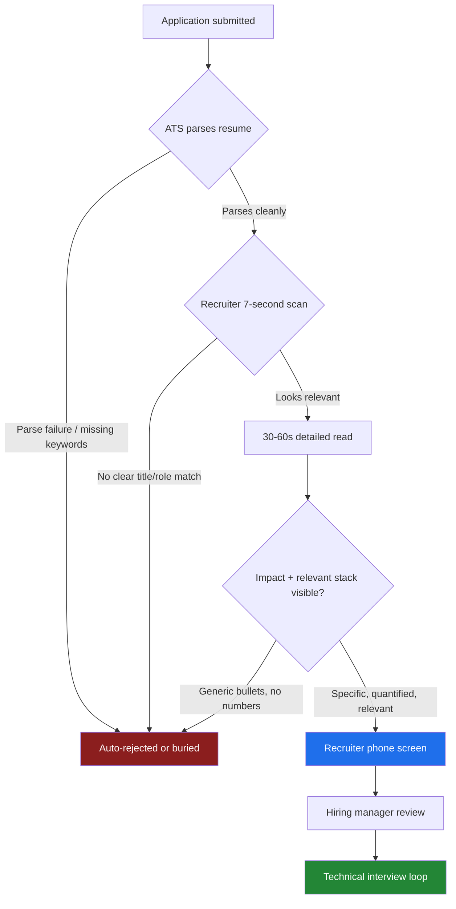
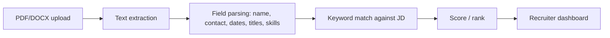
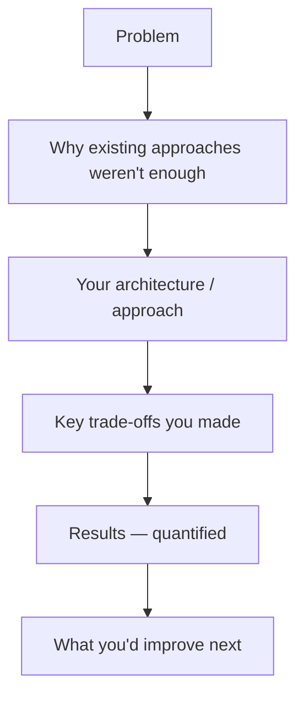

# 1️⃣ Resume Preparation for AI Engineering Roles

Your resume has one job: survive two filters — a machine and a human skim — long enough to earn a conversation. This document covers both, plus how to make your GitHub, portfolio, and LinkedIn reinforce the same story.

---

## 1.1 How Recruiters Actually Shortlist Candidates

Nobody reads your resume top to bottom on the first pass. For a mid-size AI role, a recruiter typically has **100-400 applicants** and **30-90 seconds per resume** on the first pass.

The real sequence looks like this:



What the 7-second scan is actually checking, in order:
1. **Job title / role match** — does this look like an AI/ML engineer, or a generic SWE resume with "also used ChatGPT once"?
2. **Years of relevant experience** — inferred from dates and titles, not from a summary paragraph.
3. **Recognizable company or project names** — signal, not requirement.
4. **One or two standout numbers** — anything that reads as measurable impact.

If none of these land in the first glance, the recruiter moves on. This is why the top third of your resume matters disproportionately more than the bottom.

---

## 1.2 How ATS (Applicant Tracking Systems) Work

ATS software (Workday, Greenhouse, Lever, iCIMS, Taleo) does two things: **parses** your resume into structured fields, and **ranks/filters** it against the job description.



**What breaks parsing (avoid all of these):**

| Mistake | Why it breaks ATS |
|---|---|
| Multi-column layouts, text boxes, tables for content | Parser reads left-to-right, top-to-bottom; columns get interleaved into nonsense |
| Resume as an image or scanned PDF | No extractable text at all — instant rejection |
| Headers/footers containing key info (e.g., contact info in a header) | Many parsers skip headers/footers entirely |
| Fancy icons instead of text labels (a phone icon with no "Phone:" label) | Icon glyphs often don't extract as meaningful text |
| Non-standard section titles ("My Journey" instead of "Experience") | Parser can't map the section to a known field |
| Skills buried only in prose, never listed explicitly | Keyword matcher looks for exact/near-exact terms, not paraphrases |

**What to do instead:**
- Single-column, standard fonts (Arial, Calibri, Georgia), .docx or text-based PDF.
- Standard section headers: `Experience`, `Education`, `Skills`, `Projects`.
- A dedicated **Skills** section with exact terms from job postings you're targeting (`PyTorch`, `LangChain`, `RAG`, `vLLM`, `Kubernetes` — not just "machine learning frameworks").
- Dates in a consistent, unambiguous format: `Jan 2024 – Present`.

**Keyword matching in practice**: ATS scoring is largely literal string/synonym matching. If the job description says "LLM fine-tuning" and your resume says "trained custom language models," a naive parser may not connect them. Mirror the language of the job posting where it's honestly true of your experience — don't fabricate matches for skills you don't have, because the technical round will expose that immediately.

---

## 1.3 Common Resume Mistakes (and the fix)

| Mistake | Example | Fix |
|---|---|---|
| Responsibilities, not impact | "Responsible for building chatbots" | "Built a RAG chatbot that reduced average support ticket resolution time by 35%" |
| No numbers | "Improved model performance" | "Improved model F1 score from 0.71 to 0.89 by rebalancing the training set" |
| Buzzword soup with no substance | "Leveraged synergistic AI-driven solutions" | Say exactly what you built, with what tools |
| Listing every technology you've ever touched | 40-item skills list | Keep 10-15 skills you can defend in depth under questioning |
| Wall-of-text bullets | 4-line bullet describing one task | 1-2 lines, action verb first, result last |
| Objective statement that says nothing | "Seeking a challenging role to utilize my skills" | Delete it, or replace with a 2-line targeted summary |
| Inconsistent tense | Mixing "Built" and "Building" across bullets | Past roles: past tense. Current role: present tense. Be consistent. |
| No project section for early-career candidates | Relying only on coursework | Add 2-3 substantial, well-documented projects |
| Generic, one-size-fits-all resume for every application | Same file for every role | Tailor the skills section and top bullets per role (5-10 min, not a rewrite) |

### Bullet rewriting formula

```
[Action verb] + [what you built/did] + [how, technically] + [measurable result]
```

**Before:** "Worked on a machine learning project for text classification."

**After:** "Built a text-classification pipeline (DistilBERT + custom preprocessing) that automated support-ticket triage, cutting manual routing time by 6 hours/week across a 12-person team."

**Before:** "Used LLMs to build a chatbot."

**After:** "Designed a RAG-based support chatbot (LangChain + Pinecone + GPT-4o) serving 2,000+ daily queries with 92% answer relevance measured against a held-out eval set."

---

## 1.4 Resume Optimization Checklist

**Structure (one page for <8 years experience, two pages max beyond that):**

```
Name — Title you're targeting (e.g., "AI Engineer")
Contact: email · LinkedIn · GitHub · portfolio (no home address needed)

Summary (optional, 2 lines max — only if it adds real signal)

Skills
  Languages: Python, SQL, ...
  ML/AI: PyTorch, Transformers, LangChain, RAG, fine-tuning, ...
  Infra: Docker, Kubernetes, AWS/GCP, CI/CD, ...

Experience
  Company — Title — Dates
    - Bullet (impact-first)
    - Bullet
    - Bullet

Projects
  Project name — [GitHub link]
    - What it does, stack used, one measurable/impressive detail

Education
  Degree — School — Year
```

**Line-by-line checklist:**
- [ ] Title under your name matches the role family you're applying to
- [ ] Every experience bullet has a number, a result, or a clear technical specificity
- [ ] No bullet is purely a responsibility with no outcome
- [ ] Skills section uses exact terms from target job postings (only tools you can discuss for 5+ minutes)
- [ ] Every project links to a working GitHub repo
- [ ] No spelling/grammar errors (read it backward, sentence by sentence, to catch them)
- [ ] File is a text-based PDF (not scanned/flattened image), named `FirstLast_Resume.pdf`
- [ ] Tailored skills/summary for this specific role, not a static file

---

## 1.5 GitHub Optimization

For AI engineering roles, your GitHub is often weighted as heavily as your resume — it's the only place a hiring manager can verify you actually write the code you claim to.

**Profile-level:**
- Pin 4-6 repositories that best represent AI engineering work (not your very first "Hello World").
- Profile README (`username/username` repo) with a short bio, current focus, and links — treat it like a mini-landing page.
- Consistent contribution activity is a soft signal; don't manufacture fake commit streaks, but do keep genuinely working on something.

**Per-repository:**

| Element | Why it matters | Minimum bar |
|---|---|---|
| README with problem statement | Reviewer understands *why* before *how* | 2-3 sentences on the problem, who it's for |
| Architecture diagram | Shows systems thinking, not just scripting | One Mermaid or image diagram |
| Setup instructions that actually work | Reviewers *will* try to run it | `pip install -r requirements.txt && python app.py` should just work |
| Clear commit history | Shows real, incremental development, not one squashed dump | Multiple meaningful commits, not "final final v2" |
| Tests | Signals production mindset | At least a few unit tests for core logic |
| License | Shows awareness of OSS norms | MIT/Apache-2.0 for portfolio projects |

**Red flags reviewers look for and you should avoid:**
- Repos that are 90% boilerplate from a tutorial with your name swapped in.
- No commit history (one giant initial commit = likely copy-pasted).
- `.env` files or API keys committed to history (immediate credibility loss — and a real security issue).
- READMEs that promise features the code doesn't actually have.

---

## 1.6 Portfolio Optimization

A portfolio site is optional but high-leverage for AI roles because it lets you show *working systems*, not just code.

**What a strong AI engineer portfolio includes:**
1. **2-4 deep-dive projects**, each with: the problem, your architecture (diagram), key technical decisions and trade-offs, and results/metrics.
2. **A live demo** where feasible — a hosted chatbot, a Streamlit/Gradio app, an API with a simple UI. Working demos convert far better than screenshots.
3. **Short write-ups on hard problems you solved** (e.g., "reducing RAG hallucination rate from 18% to 4%") — this is what differentiates you from someone who followed a tutorial.
4. **A clear "About" and contact path** — recruiters should be able to reach you in one click.

Keep it fast-loading and mobile-friendly; a portfolio that's slow to load actively costs you before anyone reads the content.

---

## 1.7 LinkedIn Optimization

Recruiters search LinkedIn with keyword filters similar to ATS. Treat your profile as a second resume that's also a search target.

| Section | Optimization |
|---|---|
| Headline | Not just "Software Engineer" — include your specialization: "AI Engineer \| RAG Systems, LLM Fine-tuning, Python" |
| About | 3-5 sentences: what you do, what you've built, what you're looking for. First-person, concrete, no buzzword-only fluff |
| Featured section | Pin your best project, a demo video, or a strong post — this is prime visual real estate |
| Experience | Mirror your resume bullets (consistency matters — recruiters cross-check) |
| Skills | Add and get endorsed for the specific tools you use; reorder so the top 3 match your target role |
| Open to Work | Set visibility correctly (recruiters-only vs. public) depending on your current employment situation |
| Activity | Occasional posts about projects/learnings signal genuine engagement, not just a static profile |

---

## 1.8 Project Selection

Not all projects are equal signal. Evaluate candidate projects against this table before committing weeks to one:

| Criterion | Weak project | Strong project |
|---|---|---|
| Originality | Tutorial-following clone with no changes | Solves a real problem or adds a genuine twist/constraint |
| Depth | Single API call to an LLM | Involves retrieval, evaluation, fine-tuning, or a nontrivial pipeline |
| Completeness | Works "on my machine" only | Deployed, documented, has tests |
| Talkability | Nothing hard happened | You can talk for 10+ minutes about trade-offs and what you'd do differently |
| Relevance | Unrelated to target role (e.g., a game when applying for MLE) | Directly demonstrates the skills in the job description |

**Good AI engineering project archetypes:**
- A RAG system with a *documented* evaluation methodology (not just "it works").
- A fine-tuned/LoRA-adapted small model for a specific task, with before/after metrics.
- An agent that uses tools/function calling to complete a multi-step task reliably, with guardrails.
- An MLOps pipeline: data versioning → training → evaluation → deployment → monitoring.

Pick **2-3** projects and go deep rather than 8 shallow ones — depth is what survives technical follow-up questions.

---

## 1.9 Project Presentation

How you talk about a project matters as much as what you built. Use this structure in both your README and verbally in interviews:



**Template for describing a project in an interview (60-90 seconds):**

> "The problem was [X]. I built [system], using [core stack], because [specific reason for that choice over alternatives]. The hardest part was [specific technical challenge], which I solved by [approach]. That got us [quantified result]. If I did it again, I'd [improvement] — I ran out of time to [specific known gap]."

This structure works because it demonstrates: problem framing, technical decision-making, resilience through a real obstacle, measurable outcome, and self-awareness — five signals in under two minutes.

---

*Next: [`02_hr_behavioral.md`](02_hr_behavioral.md) — turning your resume and projects into strong behavioral answers.*
