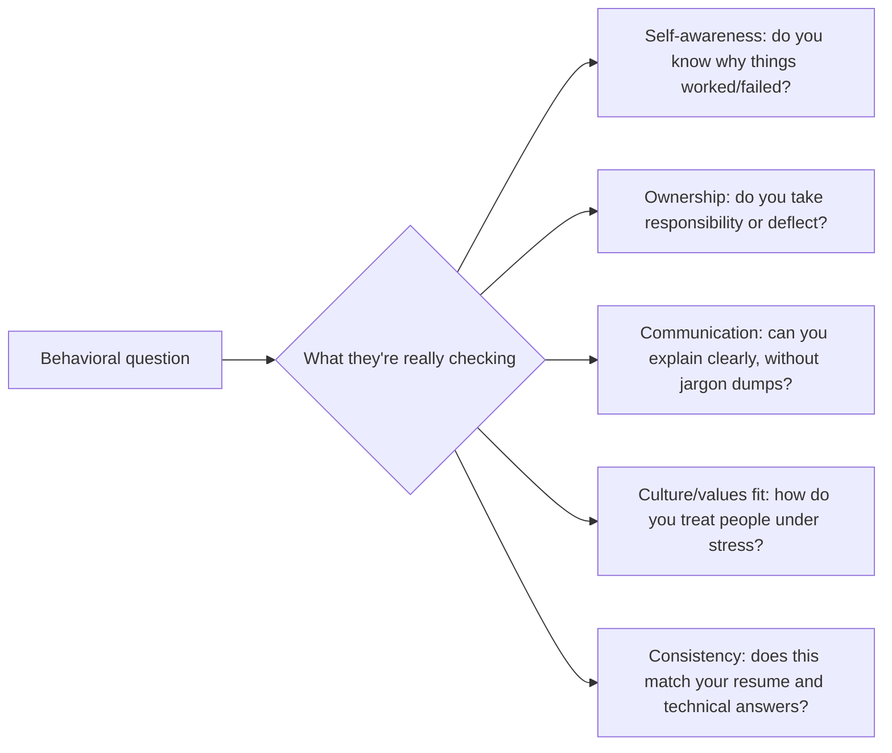
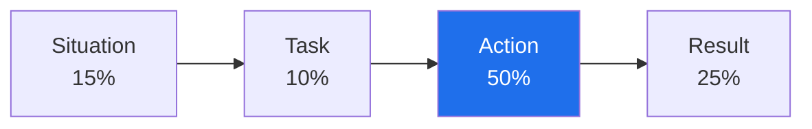

# 2️⃣ HR & Behavioral Interviews

Technical rounds test whether you *can* do the job. The HR/behavioral round tests whether you're someone people want to work with under pressure, ambiguity, and disagreement — for an AI engineering role, that increasingly includes how you handle model failures, ambiguous requirements, and shipping under uncertainty.

---

## 2.1 What the HR Round Is Actually Screening For

A "good" answer to a behavioral question is rarely about the outcome being impressive — it's about whether your *reasoning and behavior* were sound. A messy project that you handled with clear ownership and learning often scores better than a smooth project with no real challenge in it.

---

## 2.2 The STAR Method

STAR is the standard structure for behavioral answers — use it even when not asked to, because it keeps your answer tight and complete.

| Letter | Stands for | What to include | Typical length |
|---|---|---|---|
| **S** — Situation | Context: where, when, what was at stake | 1-2 sentences | ~15% of answer |
| **T** — Task | Your specific responsibility or goal | 1 sentence | ~10% of answer |
| **A** — Action | What *you* specifically did (not "we") | 3-5 sentences | ~50% of answer |
| **R** — Result | Outcome, ideally quantified, plus what you learned | 1-2 sentences | ~25% of answer |

**Common STAR mistakes:**

| Mistake | Fix |
|---|---|
| All Situation, no Action ("we had a big project...") | Spend most of your time on what *you* specifically did |
| Using "we" for everything | Say "I" for your contributions, "we" for team context — interviewers need to isolate your role |
| No Result, or a vague one | End with a concrete outcome and a takeaway, even for a failure story |
| Rehearsed to the point of sounding scripted | Practice the structure, not a memorized script — leave room for natural follow-up |
| Picking a trivial example | Choose situations with genuine stakes, ambiguity, or conflict — that's what shows judgment |

**Preparation tip:** Build a bank of 6-8 real stories from your experience *before* the interview, and map each one to multiple possible question types (a good conflict story often also works as a "failure" or "influencing without authority" story). Don't try to invent a new story live for every question.

---

## 2.3 Common HR Questions (with model answer structure)

### "Tell me about yourself"

Not an invitation for your full life story. Use a **Present → Past → Future** structure in under 90 seconds:

> **Present**: "I'm currently an AI engineer at [company], focused on [specific area, e.g., RAG systems for internal knowledge search]."
> **Past**: "Before that, I [relevant prior experience/education] which is where I first got into [specific technical area]."
> **Future**: "I'm looking for a role like this one because I want to go deeper into [specific thing this role offers, tied to something in the JD]."

### "Why do you want to work here?"

Weak answer: "I love your mission and think it's a great company." (Generic — could apply to any company.)

Strong answer: References something specific — a product decision, an engineering blog post, a technical challenge unique to their stack — and connects it to your own trajectory. Research the company's actual engineering blog/product before this question, not just the homepage.

### "Why are you leaving your current role?"

Stay forward-looking and factual. Never badmouth a former employer or manager, even if justified — it reads as a risk signal to the interviewer, not as sympathy for you.

> "I've grown a lot in my current role, especially in [specific skill], but I'm looking for [specific thing — more ownership of the ML lifecycle, exposure to production-scale LLM systems, etc.] which this role offers."

### "What are your strengths/weaknesses?"

For weaknesses: pick something real, show self-awareness, and show concrete action taken to improve it. Avoid the cliché "I'm a perfectionist" non-answer — interviewers have heard it hundreds of times and it signals you didn't prepare honestly.

> "Early on I underestimated how much time to budget for evaluation and testing versus building — I'd get excited about the model and rush the eval harness. I now block out eval design time at the *start* of a project, before writing model code, and I track it as its own task in planning."

### "Where do you see yourself in 5 years?"

Show ambition that's plausible and aligned with the role's growth path — not a vague answer, and not "your job" in a way that sounds like you're only using this as a stepping stone.

---

## 2.4 Leadership & Ownership

Even for individual-contributor roles, interviewers probe for leadership *behavior* — driving a decision, unblocking a team, or owning an outcome without being asked.

**Signals interviewers look for:**
- Did you take initiative before being told to?
- Did you make a call under ambiguity, or wait for someone else to decide?
- Did you follow through to the actual outcome, not just your piece of it?

**Example prompt: "Tell me about a time you led a project without formal authority."**

> *(S)* Our team's RAG pipeline had a rising hallucination rate, but no one owned root-causing it — it fell between the ML and backend teams. *(T)* I decided to own the investigation myself, even though it wasn't formally my task. *(A)* I built a small eval harness to isolate whether the issue was retrieval quality or generation, pulled in one engineer from each team for a 30-minute working session once I had data, and proposed a fix (a reranking step) with a before/after comparison. *(R)* Hallucination rate dropped from 18% to 6% on our eval set, and the eval harness became the team's standard regression check going forward.

**Ownership language patterns to use:** "I decided," "I proposed," "I followed up," "I made sure," "I flagged before it became a problem." Avoid answers where every verb is passive ("it was decided," "we ended up doing").

---

## 2.5 Conflict Resolution

Interviewers want to see that you handle disagreement productively, not that you avoid it or "win" it.

**Structure for a strong conflict story:**
1. What was the actual disagreement (technical or interpersonal — technical disagreements with a teammate are great AI-engineering examples: e.g., disagreeing on model choice, evaluation methodology, or build-vs-buy).
2. How you engaged with the other person's view genuinely (not just "I explained why I was right").
3. How it was resolved — ideally via data, a small experiment, or a structured trade-off discussion, not by authority or attrition.
4. What the relationship/outcome looked like afterward.

**Example: disagreeing with a teammate over model choice**

> *(S)* A teammate wanted to fine-tune a custom model for our classification task; I believed a well-prompted off-the-shelf model with few-shot examples would get us there faster and cheaper. *(T)* We had a deadline in two weeks and needed to pick one path. *(A)* Instead of debating in the abstract, I suggested we timebox one day each to build a minimal version of both approaches against the same eval set, so the decision would be based on data rather than opinion. I made sure to genuinely test his approach fairly, not just mine. *(R)* The few-shot approach hit 89% accuracy against his fine-tuned model's 84% within the timebox, so we shipped mine — but his fine-tuning exploration informed a later project where fine-tuning *was* the right call. We both trusted the process more afterward.

**Red flag answers to avoid:** stories where the conflict is resolved by you simply being right and the other person conceding with no real engagement, or stories where you throw a teammate/manager under the bus.

---

## 2.6 Failures

This is the question most candidates handle worst — either by picking a fake "humble-brag" failure ("I worked too hard") or by picking a real failure and sounding defensive about it.

**What makes a failure story strong:**
- It's a *real* failure with real consequences — not a disguised success.
- You clearly and specifically own your part in it (no blaming teammates, tooling, or "bad luck" as the primary cause).
- You show precisely what you changed afterward, and ideally evidence that the change worked (a later situation where you applied the lesson).

**Example:**

> *(S)* I shipped a RAG-based internal search tool without setting up proper evaluation before launch, because I was confident it "felt" accurate from my own testing. *(T)* Within a week, users reported it confidently answering questions with information that wasn't in our knowledge base — a hallucination problem I hadn't measured. *(A)* I had to pull the feature back, build a proper eval set from real user queries, and add a retrieval-confidence threshold that would return "I don't have enough information" instead of guessing. *(R)* It cost us about two weeks and some user trust we had to rebuild. Since then, I don't ship any generative feature without an eval harness *before* launch — I did that on my next two projects and caught issues pre-launch both times.

---

## 2.7 Learning & Growth Mindset

AI engineering changes fast; interviewers want evidence you actually keep up, not just that you claim to.

**Strong signals:**
- Specific recent things you learned (a paper, a technique, a new tool) and *what you did with it* — not just "I read about it."
- Evidence of learning from failure (see 2.6) rather than just successes.
- Asking good questions in the interview itself — that's a live demonstration of curiosity.

**Example prompt: "Tell me about something you learned recently that changed how you work."**

> "I read about evaluation-driven development for LLM features — essentially, writing your eval set before writing your prompt or pipeline, the same way you'd write tests before code. I started applying it on my last two projects: for a summarization feature, I wrote 30 example inputs with target outputs before touching the prompt, which let me catch a systematic issue with how the model handled long documents *before* it hit production, instead of after user complaints."

**Weak answer pattern to avoid:** naming a trendy topic (e.g., "I've been reading about AI agents") with no specifics about what you actually did differently as a result. Interviewers can tell the difference between real engagement and name-dropping within one follow-up question.

---

## 2.8 Quick-Reference: Question Bank by Category

| Category | Sample questions |
|---|---|
| Self / motivation | Tell me about yourself · Why this company · Why this role · Why are you leaving |
| Ownership | Time you took initiative · Time you owned a mistake · Time you drove a decision without authority |
| Conflict | Disagreement with a teammate · Pushback from a manager · Time you changed your mind after being challenged |
| Failure | A project that didn't go as planned · A mistake with real consequences · Feedback that was hard to hear |
| Teamwork | Time you helped an underperforming teammate · Time you had to influence without authority · Cross-team collaboration |
| Ambiguity/pressure | Time requirements were unclear · Tight deadline with incomplete information · Prioritizing under conflicting demands |
| Growth | Something you learned recently · Skill you're actively developing · Feedback you acted on |

**Prep exercise:** for each row above, write one real story (bullet-point STAR outline, not full prose) before your interview. That gives you 7 flexible stories that can answer the large majority of behavioral questions asked in practice.

---

*Previous: [`01_resume_preparation.md`](01_resume_preparation.md) · Back to [Interview Handbook index](README.md)*
