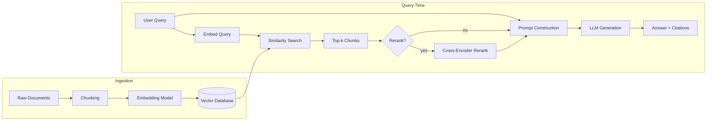

# 6️⃣ LLM Interview Handbook

> Part of the [Interview Handbook](README.md). Covers what AI engineering interviews actually probe today: model landscape, RAG, fine-tuning, evaluation, and the failure modes you're expected to know how to mitigate.

## 📑 Contents
- [Model Landscape](#model-landscape)
- [Tokenization & Context Windows](#tokenization--context-windows)
- [Prompt Engineering](#prompt-engineering)
- [Embeddings & Vector Databases](#embeddings--vector-databases)
- [RAG (Retrieval-Augmented Generation)](#rag-retrieval-augmented-generation)
- [Chunking Strategies](#chunking-strategies)
- [Fine-Tuning, LoRA, QLoRA](#fine-tuning-lora-qlora)
- [Inference](#inference)
- [Evaluation](#evaluation)
- [Hallucination](#hallucination)
- [Architecture Diagram: RAG Pipeline](#architecture-diagram-rag-pipeline)
- [Interview Questions](#interview-questions)

---

## Model Landscape

| Family | Notable traits | Typical strength |
|---|---|---|
| **GPT (OpenAI)** | General-purpose, strong tool-use/function-calling ecosystem | Broad reasoning, wide plugin/agent tooling |
| **Claude (Anthropic)** | Long context, strong at following detailed instructions and careful reasoning, constitutional-AI alignment approach | Long-document work, agentic coding, careful/cautious behavior |
| **Gemini (Google)** | Native multimodality, deep integration with Google Cloud/Workspace | Multimodal tasks, very long context in some variants |
| **Llama (Meta)** | Open-weights, widely fine-tuned by the community | Self-hosting, customization, cost control |

Interviewers rarely want brand loyalty — they want you to reason about **trade-offs**: latency vs quality, cost per token, context window, open-weights vs API-only, data-residency/compliance constraints.

## Tokenization & Context Windows
- LLMs operate on **tokens**, not characters or words — a token is roughly 3-4 characters of English text on average (varies by tokenizer, e.g., BPE/tiktoken).
- **Context window** = the maximum number of tokens (input + output combined, for most APIs) the model can attend to at once.
- Longer context ≠ free — cost scales with tokens, and very long contexts can suffer from "lost in the middle" (models attend less reliably to information buried in the center of a long prompt vs the start/end).

## Prompt Engineering
- **Zero-shot**: task description only. **Few-shot**: task + example input/output pairs. **Chain-of-thought**: ask the model to reason step by step before answering — improves performance on multi-step reasoning tasks.
- **System prompts**: set persistent behavior/role/constraints separate from user turns.
- **Structured output**: ask for JSON/XML with an explicit schema, ideally combined with the provider's structured-output/tool-calling feature rather than relying purely on prompt instructions.
- **Prompt injection**: untrusted content (web pages, documents, tool outputs) can contain instructions that hijack the model — mitigations include clear delimiters, treating retrieved/tool content as data not instructions, and least-privilege tool permissions.

## Embeddings & Vector Databases
- An embedding model maps text to a dense vector such that semantically similar text is close in vector space (cosine similarity / dot product).
- **Vector databases** (Pinecone, Weaviate, Qdrant, pgvector, Milvus, FAISS for local/in-memory) index these vectors for fast approximate nearest-neighbor (ANN) search — exact search is O(n) per query and doesn't scale.
- Common ANN index types: **HNSW** (graph-based, high recall, higher memory), **IVF** (cluster-based, faster build, tunable recall/speed).

## RAG (Retrieval-Augmented Generation)
The core idea: instead of relying solely on parametric knowledge baked into weights, retrieve relevant documents at query time and inject them into the prompt.

**Standard pipeline:**
1. Ingest documents → chunk → embed → store in vector DB.
2. At query time: embed the user query → retrieve top-k similar chunks → (optionally rerank) → construct a prompt with retrieved context → generate answer.

**Why RAG over pure fine-tuning for knowledge**: RAG keeps knowledge up to date without retraining, is cheaper to update, and lets you cite sources — but it adds retrieval latency and is only as good as retrieval quality (garbage in, garbage out).

**Advanced RAG techniques interviewers probe:**
- **Hybrid search**: combine dense (embedding) + sparse (BM25/keyword) retrieval — catches exact-match terms (IDs, acronyms) embeddings sometimes miss.
- **Reranking**: retrieve a larger candidate set with a cheap method, then rerank with a more expensive cross-encoder for precision.
- **Query rewriting/decomposition**: rewrite vague queries or split multi-part questions before retrieval.
- **Agentic RAG**: let the model decide *whether* and *how many times* to retrieve, rather than a fixed single retrieval step.

## Chunking Strategies
| Strategy | Idea | Trade-off |
|---|---|---|
| Fixed-size | Split every N tokens with overlap | Simple, but can cut sentences/ideas mid-thought |
| Recursive/semantic | Split on paragraph/sentence boundaries, falling back to smaller units | Preserves meaning, more implementation complexity |
| Document-structure-aware | Split on headers/sections (Markdown, HTML) | Best for structured docs (manuals, wikis) |
| Sliding window with overlap | Overlapping chunks (e.g., 20% overlap) | Reduces boundary information loss, increases storage/index size |

## Fine-Tuning, LoRA, QLoRA
- **Full fine-tuning**: update all model weights — best adaptation, highest compute/memory cost, risk of catastrophic forgetting.
- **LoRA (Low-Rank Adaptation)**: freeze the base model, inject small trainable low-rank matrices into attention/MLP layers. Drastically reduces trainable parameters (often <1%) while approximating full fine-tuning quality for many tasks.
- **QLoRA**: LoRA on top of a 4-bit quantized base model — enables fine-tuning large models on a single consumer/prosumer GPU by cutting memory footprint further.
- **When to fine-tune vs RAG vs prompt engineering**: fine-tune for *style/format/behavior* changes and domain-specific tone; use RAG for *fresh or large external knowledge*; use prompting alone when the task is well within the base model's existing capability.

## Inference
- **KV cache**: during autoregressive generation, cache the Key/Value projections from previous tokens so each new token doesn't recompute attention over the whole sequence from scratch — major speedup at the cost of memory.
- **Batching**: serve multiple requests together to better utilize GPU throughput; **continuous batching** (vLLM, TGI) dynamically adds/removes sequences from the batch as they finish, rather than waiting for the whole batch to complete.
- **Quantization**: reduce weight precision (FP16 → INT8/INT4) to shrink memory footprint and increase throughput, at some quality cost.
- **Speculative decoding**: use a small "draft" model to propose several tokens, verified in parallel by the large model — can meaningfully speed up generation when the draft model's guesses are usually accepted.

## Evaluation
- **Automatic metrics**: BLEU/ROUGE (n-gram overlap, weak for open-ended generation), perplexity (language modeling quality, not task quality), exact-match/F1 (QA tasks with a ground truth).
- **LLM-as-judge**: use a strong model to score outputs against a rubric — scales better than human eval but has its own biases (position bias, verbosity bias) that need to be controlled for.
- **Human eval**: gold standard for subjective quality, expensive, needs clear rubrics and inter-rater agreement checks.
- **Task-specific eval harnesses**: for RAG specifically, evaluate retrieval (recall@k, MRR) and generation (faithfulness/groundedness to retrieved context, answer relevancy) separately — a system can retrieve perfectly and still hallucinate, or retrieve poorly and still sound confident.

## Hallucination
Definition: the model generates fluent, confident output that is factually incorrect or unsupported by its input/context.

**Causes**: gaps in training data, next-token prediction objective rewards plausible-sounding continuations, no built-in mechanism to say "I don't know" unless explicitly trained/prompted for it, and — in RAG — retrieval failing to surface the right context (so the model fills the gap from parametric memory).

**Mitigations**: RAG with citation requirements, lower temperature for factual tasks, explicit "answer only from the provided context, say 'I don't know' otherwise" instructions, self-consistency/majority-vote sampling, faithfulness-focused evaluation in the loop, and structured verification steps (e.g., a second pass that checks claims against sources).

## Architecture Diagram: RAG Pipeline

---

## Interview Questions
1. Walk through how you'd design a RAG system for a 50,000-document internal knowledge base. What would you monitor in production?
2. When would you choose fine-tuning over RAG, and vice versa?
3. Explain the KV cache and why it matters for inference latency.
4. How would you detect and reduce hallucination in a customer-facing RAG chatbot?
5. What's the difference between LoRA and full fine-tuning, and what does that mean for GPU memory requirements?
6. How does context window size affect cost and latency, and what's the "lost in the middle" problem?
7. Design an evaluation suite for an LLM-powered support assistant — what would you measure, and how?

---
*Part of the [AI Engineer Handbook](../../README.md) · [Interview Handbook](README.md) · Next: [AI Agents](07_ai_agents.md).*
