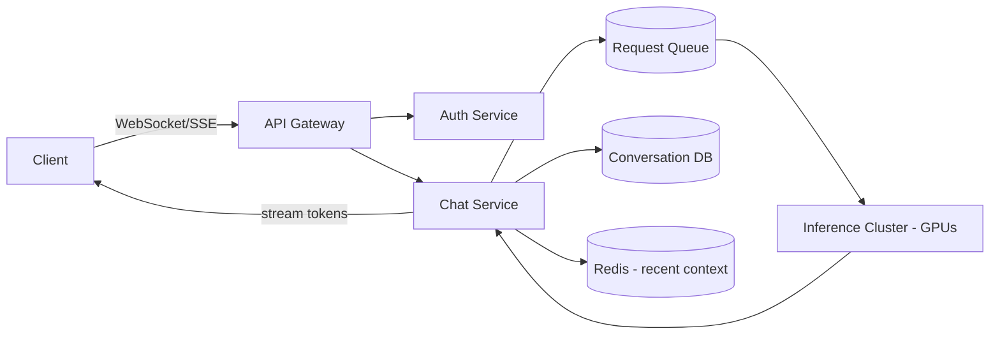

# 8️⃣ System Design Interview

> Part of the [Interview Handbook](README.md). Building blocks first, then worked examples for AI-product and classic system design prompts.

## 📑 Contents
- [How to Structure Any Answer](#how-to-structure-any-answer)
- [Building Blocks](#building-blocks)
- [Design: ChatGPT-style Chat Product](#design-chatgpt-style-chat-product)
- [Design: RAG System](#design-rag-system)
- [Design: GitHub Copilot / Cursor-style Coding Assistant](#design-github-copilot--cursor-style-coding-assistant)
- [Design: WhatsApp](#design-whatsapp)
- [Design: Uber](#design-uber)
- [Design: YouTube / Netflix (video streaming)](#design-youtube--netflix-video-streaming)
- [Design: Gmail](#design-gmail)
- [Interview Questions](#interview-questions)

---

## How to Structure Any Answer
1. **Clarify requirements** (~3-5 min): functional (what must it do), non-functional (scale, latency, availability), and explicit constraints (budget, existing infra).
2. **Estimate scale**: DAU, QPS, storage growth, read/write ratio — back-of-envelope math, not precision.
3. **High-level design**: draw boxes (client, API gateway, services, DB, cache, queue) before diving into any one box.
4. **Deep dive** into the 1-2 components the interviewer cares about most (they'll usually steer you).
5. **Address bottlenecks & trade-offs** explicitly — every choice should have a stated "why this over the alternative."
6. **Wrap with failure modes**: what happens when a component goes down, and how you'd monitor it.

## Building Blocks

| Concept | What it solves | Trade-off to mention |
|---|---|---|
| **Caching** (Redis/Memcached, CDN) | Reduces read latency and DB load | Cache invalidation is the hard part; choose TTL vs write-through vs write-back deliberately |
| **Queues** (Kafka, SQS, RabbitMQ) | Decouples producers/consumers, smooths traffic spikes, enables async processing | Adds eventual consistency and operational complexity |
| **Databases** | SQL for strong consistency/relations, NoSQL for horizontal scale/flexible schema | Pick based on access patterns, not popularity |
| **Load Balancing** | Distributes traffic, enables horizontal scaling | L4 (fast, less smart) vs L7 (content-aware routing, more overhead) |
| **CAP theorem** | Under a network partition, choose Consistency or Availability, not both | Most user-facing systems favor AP with eventual consistency; financial ledgers favor CP |
| **Rate Limiting** | Protects backend from abuse/overload | Token bucket (bursty-friendly) vs sliding window (smoother, more precise) |
| **Microservices** | Independent deployability, team scalability, fault isolation | Network calls replace function calls — adds latency, requires distributed tracing/observability |
| **Sharding** | Horizontal scale beyond a single DB instance | Choosing a shard key is the whole game — pick one that avoids hot shards |

---

## Design: ChatGPT-style Chat Product

**Requirements**: users send messages, get streamed LLM responses, conversation history persists, supports concurrent sessions at scale.

**Key decisions**:
- **Streaming**: use SSE or WebSockets to stream tokens as generated, not wait for the full response — dramatically improves perceived latency.
- **Context management**: store full history in a DB, keep recent turns in a fast cache; truncate/summarize older turns when approaching the context window limit.
- **Inference scaling**: continuous batching (vLLM/TGI-style) across a GPU cluster; route by model size/tenant priority; autoscale on queue depth, not just CPU.
- **Cost control**: token-based rate limiting per user/tier, response caching for identical prompts where applicable.

## Design: RAG System
See the full pipeline diagram in the [LLM Interview guide](06_llm_interview.md#architecture-diagram-rag-pipeline). System-design-specific additions:
- **Ingestion pipeline** as an async job (queue-driven), not inline with user requests — document processing/embedding is slow and shouldn't block writes.
- **Vector DB scaling**: sharding by tenant/namespace for multi-tenant SaaS; replicas for read scaling.
- **Freshness**: incremental re-indexing on document updates rather than full re-embedding; track document versions.
- **Observability**: log retrieved chunks and relevance scores per query so you can debug "why did it answer that" after the fact.

## Design: GitHub Copilot / Cursor-style Coding Assistant
**Requirements**: low-latency inline code completion plus higher-latency chat/agentic edits, aware of the local codebase.

- **Two-tier model strategy**: a small, fast model for inline autocomplete (must respond in <100-300ms to feel responsive) and a larger model for chat/agentic multi-file edits (latency budget in seconds is acceptable).
- **Context construction**: build the prompt from the current file, cursor position, and relevant surrounding code — often via a lightweight local index (recently edited files, symbol/embedding search over the repo) rather than sending the whole repo.
- **Edit application**: for agentic edits, generate a diff/patch rather than free text, apply it deterministically, and show the user a reviewable diff before commit.
- **Privacy**: code often can't leave the customer's environment — support local/on-prem inference or strict data-retention guarantees as a first-class requirement, not an afterthought.

## Design: WhatsApp
- **Core need**: reliable, low-latency message delivery, offline support, end-to-end encryption.
- Persistent connections (WebSocket) per online client; messages for offline users queued and pushed via mobile push notification + delivered on reconnect.
- Message storage: fan-out on write for 1:1 and small groups; message queue + async fan-out for very large groups to avoid write amplification blocking the sender.
- Encryption: Signal-protocol-style end-to-end encryption means the server routes ciphertext it cannot read — search/indexing must happen client-side.

## Design: Uber
- Core components: rider app, driver app, matching service, pricing/surge service, trip service, maps/ETA service.
- **Geospatial indexing** (geohash or quad-tree) to efficiently find nearby drivers instead of scanning all drivers' locations.
- Driver location updates are extremely high frequency and write-heavy — use a fast in-memory store (Redis with geospatial commands) rather than the primary relational DB for live location.
- Matching is a real-time optimization problem balancing ETA, driver supply, and fairness — often a separate dedicated service with its own SLAs.

## Design: YouTube / Netflix (video streaming)
- **Upload pipeline**: async transcoding into multiple resolutions/bitrates (adaptive bitrate streaming, e.g., HLS/DASH) so playback can adjust to the viewer's network conditions.
- **Delivery**: CDN-first architecture — the vast majority of requests should be served from edge caches, not origin.
- **Metadata vs blob storage split**: video files in object storage (S3-style) + CDN; structured metadata (titles, view counts, recommendations) in a separate DB optimized for those access patterns.
- **Recommendations**: typically a separate ML pipeline (batch-computed candidate generation + real-time ranking), decoupled from the core playback path so a recommendation outage never blocks video playback.

## Design: Gmail
- **Core need**: reliable storage of a huge, ever-growing mail archive with fast full-text search and near-instant delivery.
- Inbound mail goes through a receiving pipeline (SMTP → spam/virus filtering → storage → indexing) before hitting the user's inbox — async, not synchronous with the SMTP handshake.
- Search: a dedicated search index (inverted index, e.g., Elasticsearch-like) kept in sync with the mail store, since relational LIKE-queries don't scale to full-text search at this volume.
- Storage: label-based (not folder-based) model means a single message can appear in multiple views without duplication — implemented via a labels join table, not by copying the message.

---

## Interview Questions
1. Design a URL shortener — what's the bottleneck at 1B URLs, and how do you shard it?
2. How would you design rate limiting for a public LLM API serving multiple pricing tiers?
3. Design a notification system that supports push, email, and SMS with delivery guarantees.
4. Walk through how you'd scale a RAG system from 10 documents to 10 million documents — what breaks first?
5. Design a real-time collaborative document editor (Google Docs) — what consistency model do you use, and why?

---
*Part of the [AI Engineer Handbook](../../README.md) · [Interview Handbook](README.md) · Next: [Coding Interview](09_coding_interview.md).*
